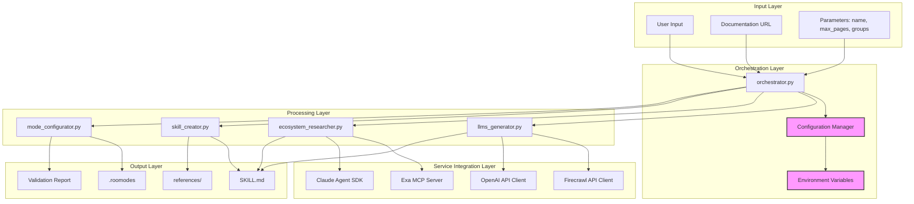
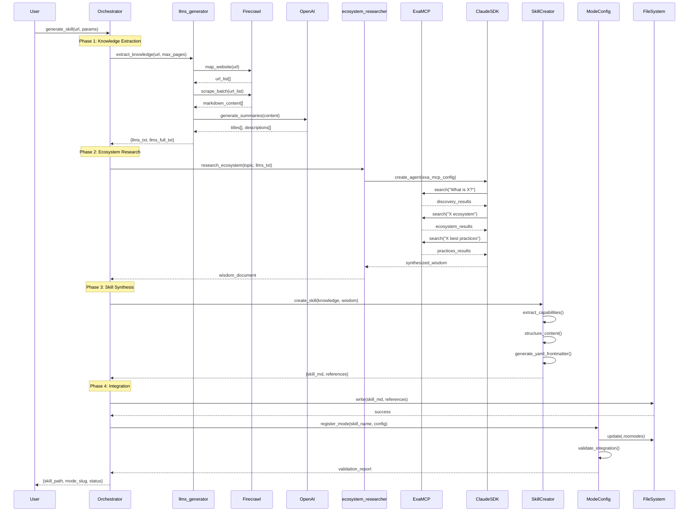
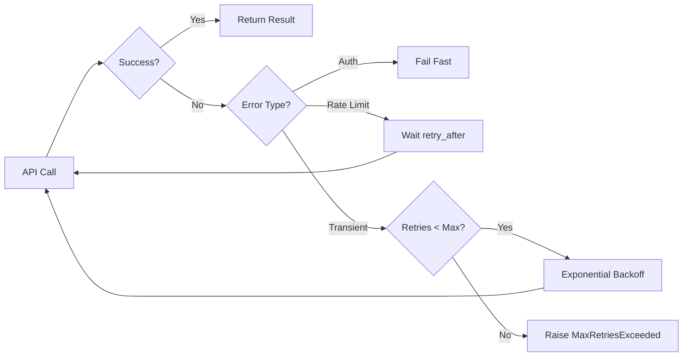
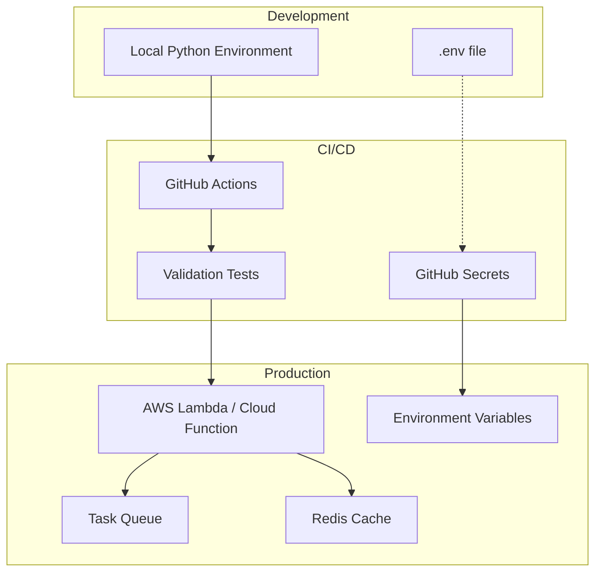

# Agent Skill Generator System Architecture

## System Overview

The Agent Skill Generator is a modular Python system that transforms web documentation into integrated Roo Code skills. It orchestrates multiple AI services (Firecrawl, OpenAI, Claude, Exa MCP) to extract knowledge, research ecosystem context, and synthesize comprehensive skill definitions.

**Design Principles**:
- **Modularity**: Each phase is an independent module with clear interfaces
- **Extensibility**: New research strategies or output formats can be added
- **Security**: All secrets managed via environment variables
- **Resilience**: Graceful degradation and retry logic for API failures

---

## 1. System Components Architecture



---

## 2. Data Flow Architecture



---

## 3. Module Boundaries and Interfaces

### 3.1 Orchestrator Module

**Responsibility**: Coordinate the complete skill generation workflow

**Interface**:
```python
class SkillOrchestrator:
    """Main orchestrator for skill generation pipeline."""
    
    def __init__(self, config: OrchestratorConfig):
        """Initialize with configuration and API clients."""
        pass
    
    def generate_skill(
        self,
        url: str,
        skill_name: str,
        max_pages: int = 50,
        groups: List[str] = ["read", "edit"]
    ) -> SkillGenerationResult:
        """
        Orchestrate complete skill generation.
        
        Returns:
            SkillGenerationResult with paths, validation status, and metadata
        """
        pass
```

**Dependencies**: All processing modules, configuration manager

---

### 3.2 LLMS Generator Module

**Responsibility**: Extract and structure documentation knowledge

**Interface**:
```python
class LLMSGenerator:
    """Handles documentation scraping and summarization."""
    
    def __init__(self, firecrawl_client: FirecrawlClient, openai_client: OpenAIClient):
        pass
    
    def extract_knowledge(
        self,
        url: str,
        max_pages: int = 50
    ) -> KnowledgeBundle:
        """
        Extract structured knowledge from documentation URL.
        
        Returns:
            KnowledgeBundle(llms_txt, llms_full_txt, metadata)
        """
        pass
    
    def _map_website(self, url: str, limit: int) -> List[str]:
        """Discover all documentation URLs."""
        pass
    
    def _scrape_content(self, urls: List[str]) -> List[MarkdownPage]:
        """Scrape markdown content from URLs."""
        pass
    
    def _generate_summaries(self, pages: List[MarkdownPage]) -> List[Summary]:
        """Generate titles and descriptions using OpenAI."""
        pass
```

**Dependencies**: Firecrawl API, OpenAI API

---

### 3.3 Ecosystem Researcher Module

**Responsibility**: Research tool positioning, use cases, and best practices

**Interface**:
```python
class EcosystemResearcher:
    """Uses Claude Agent SDK + Exa MCP for ecosystem research."""
    
    def __init__(self, agent_config: AgentConfig, exa_mcp_config: MCPConfig):
        pass
    
    def research_ecosystem(
        self,
        topic: str,
        knowledge_context: str
    ) -> WisdomDocument:
        """
        Execute sequential Feynman research process.
        
        Returns:
            WisdomDocument with ecosystem insights
        """
        pass
    
    def _discovery_phase(self, topic: str) -> ResearchPhaseResult:
        """Phase 1: What is it? Who uses it?"""
        pass
    
    def _ecosystem_mapping(self, topic: str) -> ResearchPhaseResult:
        """Phase 2: Integrations, alternatives, use cases"""
        pass
    
    def _best_practices(self, topic: str) -> ResearchPhaseResult:
        """Phase 3: Patterns, anti-patterns, security"""
        pass
    
    def _synthesize_wisdom(self, phases: List[ResearchPhaseResult]) -> WisdomDocument:
        """Combine research into structured wisdom document."""
        pass
```

**Dependencies**: Claude Agent SDK, Exa MCP Server

---

### 3.4 Skill Creator Module

**Responsibility**: Synthesize knowledge + wisdom into SKILL.md

**Interface**:
```python
class SkillCreator:
    """Creates SKILL.md files from knowledge and wisdom."""
    
    def create_skill(
        self,
        skill_name: str,
        knowledge: KnowledgeBundle,
        wisdom: WisdomDocument,
        compatible_modes: List[str] = None
    ) -> SkillBundle:
        """
        Generate SKILL.md with YAML frontmatter and content.
        
        Returns:
            SkillBundle(skill_md, references, assets)
        """
        pass
    
    def _extract_capabilities(self, knowledge: KnowledgeBundle) -> List[Capability]:
        """Extract core capabilities from documentation."""
        pass
    
    def _structure_content(
        self,
        capabilities: List[Capability],
        wisdom: WisdomDocument
    ) -> SkillContent:
        """Structure markdown sections."""
        pass
    
    def _generate_frontmatter(
        self,
        skill_name: str,
        capabilities: List[Capability],
        metadata: dict
    ) -> str:
        """Generate YAML frontmatter."""
        pass
    
    def _extract_references(self, knowledge: KnowledgeBundle) -> List[ReferenceFile]:
        """Extract large docs into reference files."""
        pass
```

**Dependencies**: None (pure synthesis)

---

### 3.5 Mode Configurator Module

**Responsibility**: Register skill in .roomodes and validate integration

**Interface**:
```python
class ModeConfigurator:
    """Manages .roomodes integration and validation."""
    
    def __init__(self, roomodes_path: str = ".roomodes"):
        pass
    
    def register_mode(
        self,
        skill_name: str,
        skill_path: str,
        role_definition: str,
        groups: List[str]
    ) -> ModeRegistrationResult:
        """
        Add mode entry to .roomodes.
        
        Returns:
            ModeRegistrationResult with validation status
        """
        pass
    
    def validate_integration(self, skill_name: str) -> ValidationReport:
        """
        Run comprehensive validation checks.
        
        Checks:
        - SKILL.md exists at path
        - YAML frontmatter valid
        - No duplicate slugs
        - Groups alignment
        - File size < 500 lines
        """
        pass
    
    def _check_duplicate_slug(self, slug: str) -> bool:
        """Check for slug conflicts."""
        pass
    
    def _validate_yaml_frontmatter(self, skill_path: str) -> bool:
        """Validate SKILL.md frontmatter."""
        pass
```

**Dependencies**: File system, JSON parser

---

## 4. Data Schemas

### 4.1 Core Data Types

```python
from dataclasses import dataclass
from typing import List, Dict, Optional
from datetime import datetime

@dataclass
class KnowledgeBundle:
    """Structured documentation knowledge."""
    llms_txt: str                    # Index with summaries
    llms_full_txt: str               # Complete content
    source_url: str
    page_count: int
    metadata: Dict[str, any]

@dataclass
class WisdomDocument:
    """Ecosystem research insights."""
    overview: str                    # 2-3 paragraph synthesis
    ecosystem_position: Dict[str, List[str]]  # category, alternatives, complements
    use_cases: List[str]
    integration_patterns: Dict[str, List[str]]
    best_practices: List[str]
    common_pitfalls: List[str]
    sources: List[str]               # Research URLs

@dataclass
class SkillBundle:
    """Complete skill package."""
    skill_md: str                    # Main SKILL.md content
    references: List[ReferenceFile]  # Extracted documentation
    assets: List[AssetFile]          # Templates, configs
    metadata: SkillMetadata

@dataclass
class SkillMetadata:
    """YAML frontmatter data."""
    name: str
    description: str
    license: str
    source_url: str
    generated_date: datetime
    generator_version: str
    compatible_modes: List[str]
    required_groups: List[str]

@dataclass
class ModeRegistrationResult:
    """Result of .roomodes integration."""
    success: bool
    slug: str
    validation_report: ValidationReport
    error: Optional[str] = None

@dataclass
class ValidationReport:
    """Validation check results."""
    all_checks_passed: bool
    checks: Dict[str, bool]          # check_name -> passed
    warnings: List[str]
    errors: List[str]
```

---

## 5. Configuration Management

### 5.1 Environment Variables

**Required**:
```bash
# API Keys (NEVER hardcode these)
FIRECRAWL_API_KEY=fc-xxx...
OPENAI_API_KEY=sk-xxx...
ANTHROPIC_API_KEY=sk-ant-xxx...

# Optional: Rate limiting
FIRECRAWL_RATE_LIMIT=10          # requests per minute
OPENAI_RATE_LIMIT=60             # requests per minute

# Optional: Retry configuration
API_RETRY_ATTEMPTS=3
API_RETRY_BACKOFF=2.0            # exponential backoff multiplier
```

### 5.2 Configuration File Pattern

**config.json** (non-sensitive settings):
```json
{
  "default_max_pages": 50,
  "default_groups": ["read", "edit"],
  "validation_rules": {
    "max_skill_lines": 500,
    "required_sections": ["Core Capabilities", "When to Use This Skill"]
  },
  "output_paths": {
    "skills_directory": ".",
    "roomodes_path": ".roomodes"
  },
  "exa_mcp_server": {
    "command": "uvx",
    "args": ["mcp-server-exa"],
    "env_var_name": "EXA_API_KEY"
  }
}
```

### 5.3 Configuration Manager

```python
class ConfigurationManager:
    """Centralized configuration with environment validation."""
    
    def __init__(self, config_file: str = "config.json"):
        self._load_config(config_file)
        self._validate_env_vars()
    
    def get_api_key(self, service: str) -> str:
        """Retrieve API key from environment."""
        key = os.getenv(f"{service.upper()}_API_KEY")
        if not key:
            raise ConfigurationError(f"Missing {service.upper()}_API_KEY")
        return key
    
    def _validate_env_vars(self):
        """Ensure all required environment variables are set."""
        required = ["FIRECRAWL_API_KEY", "OPENAI_API_KEY", "ANTHROPIC_API_KEY"]
        missing = [var for var in required if not os.getenv(var)]
        if missing:
            raise ConfigurationError(f"Missing environment variables: {missing}")
```

---

## 6. Error Handling Strategy

### 6.1 Failure Modes

```python
class ErrorHandlingStrategy:
    """Centralized error handling and retry logic."""
    
    # API Failures
    def handle_api_failure(self, error: Exception, context: str):
        """
        Retry with exponential backoff for transient failures.
        Log and fail fast for authentication errors.
        """
        if isinstance(error, AuthenticationError):
            raise  # Don't retry auth failures
        
        if isinstance(error, RateLimitError):
            self._apply_backoff(error.retry_after)
            return "RETRY"
        
        if self.retry_count < self.max_retries:
            self.retry_count += 1
            time.sleep(self.backoff_multiplier ** self.retry_count)
            return "RETRY"
        
        raise MaxRetriesExceeded(f"Failed after {self.max_retries} attempts")
    
    # Invalid URLs
    def validate_url(self, url: str) -> bool:
        """Pre-validate URLs before API calls."""
        try:
            result = urlparse(url)
            return all([result.scheme, result.netloc])
        except Exception:
            raise InvalidURLError(f"Invalid URL format: {url}")
    
    # Malformed Responses
    def handle_malformed_response(self, response: any, expected_schema: dict):
        """Validate API responses against expected schema."""
        try:
            validate(instance=response, schema=expected_schema)
            return response
        except ValidationError as e:
            # Log error, return partial data or default
            logger.error(f"Malformed response: {e}")
            return self._extract_partial_data(response)
```

### 6.2 Retry Strategy



### 6.3 Graceful Degradation

**Strategy**: Continue with partial data when non-critical steps fail

```python
def generate_skill_with_fallback(self, url: str, skill_name: str):
    """Generate skill with graceful degradation."""
    try:
        knowledge = self.llms_generator.extract_knowledge(url)
    except Exception as e:
        logger.error(f"Knowledge extraction failed: {e}")
        knowledge = self._create_minimal_knowledge(url)
    
    try:
        wisdom = self.ecosystem_researcher.research_ecosystem(skill_name, knowledge.llms_txt)
    except Exception as e:
        logger.warning(f"Ecosystem research failed, using basic wisdom: {e}")
        wisdom = self._create_basic_wisdom(skill_name)
    
    # Skill creation continues with whatever data is available
    return self.skill_creator.create_skill(skill_name, knowledge, wisdom)
```

---

## 7. Integration Points

### 7.1 Firecrawl API Integration

```python
class FirecrawlClient:
    """Wrapper for Firecrawl API with retry logic."""
    
    def __init__(self, api_key: str, rate_limit: int = 10):
        self.api_key = api_key
        self.rate_limiter = RateLimiter(rate_limit)
    
    def map_website(self, url: str, limit: int = 50) -> List[str]:
        """Call /map endpoint to discover URLs."""
        with self.rate_limiter:
            response = requests.post(
                "https://api.firecrawl.dev/v1/map",
                headers={"Authorization": f"Bearer {self.api_key}"},
                json={"url": url, "limit": limit}
            )
            return response.json()["links"]
    
    def scrape_batch(self, urls: List[str]) -> List[dict]:
        """Batch scrape with rate limiting."""
        results = []
        for url in urls:
            with self.rate_limiter:
                results.append(self._scrape_single(url))
        return results
```

### 7.2 Claude Agent SDK Integration

```python
class ClaudeAgentIntegration:
    """Manages Claude Agent SDK with Exa MCP."""
    
    def create_research_agent(self, exa_mcp_config: dict):
        """Initialize agent with Exa MCP server."""
        from anthropic import Agent
        
        agent = Agent(
            api_key=os.getenv("ANTHROPIC_API_KEY"),
            mcp_servers=[
                {
                    "name": "exa",
                    "command": exa_mcp_config["command"],
                    "args": exa_mcp_config["args"],
                    "env": {
                        "EXA_API_KEY": os.getenv("EXA_API_KEY")
                    }
                }
            ]
        )
        return agent
    
    def sequential_research(self, agent, queries: List[str]) -> List[dict]:
        """Execute sequential Feynman research."""
        results = []
        for query in queries:
            response = agent.run(query, tools=["exa_search"])
            results.append(response)
        return results
```

### 7.3 MCP Server Connection

**Exa MCP Server Configuration**:
```json
{
  "mcpServers": {
    "exa": {
      "command": "uvx",
      "args": ["mcp-server-exa"],
      "env": {
        "EXA_API_KEY": "${EXA_API_KEY}"
      }
    }
  }
}
```

**Connection Pattern**:
```python
def connect_exa_mcp():
    """Establish MCP connection to Exa server."""
    config = load_mcp_config()
    
    # Environment variable substitution
    env = {
        key: os.getenv(value.strip("${}"))
        for key, value in config["exa"]["env"].items()
    }
    
    # Spawn MCP server process
    process = subprocess.Popen(
        [config["exa"]["command"]] + config["exa"]["args"],
        env=env,
        stdout=subprocess.PIPE,
        stderr=subprocess.PIPE
    )
    
    return MCPConnection(process)
```

### 7.4 File System Operations

```python
class FileSystemManager:
    """Safe file operations with atomic writes."""
    
    def write_skill_bundle(self, bundle: SkillBundle, base_path: str):
        """Write skill files atomically."""
        skill_dir = os.path.join(base_path, bundle.metadata.name)
        os.makedirs(skill_dir, exist_ok=True)
        
        # Write main SKILL.md
        self._atomic_write(
            os.path.join(skill_dir, "SKILL.md"),
            bundle.skill_md
        )
        
        # Write references
        if bundle.references:
            ref_dir = os.path.join(skill_dir, "references")
            os.makedirs(ref_dir, exist_ok=True)
            for ref in bundle.references:
                self._atomic_write(
                    os.path.join(ref_dir, ref.filename),
                    ref.content
                )
    
    def _atomic_write(self, path: str, content: str):
        """Write file atomically using temp file + rename."""
        temp_path = f"{path}.tmp"
        with open(temp_path, 'w') as f:
            f.write(content)
        os.rename(temp_path, path)  # Atomic on POSIX systems
```

---

## 8. Security Considerations

### 8.1 API Key Management

✅ **DO**:
- Store all API keys in environment variables
- Use `.env` files with `.gitignore` entry
- Validate keys at startup
- Rotate keys regularly

❌ **DON'T**:
- Hardcode keys in source code
- Commit keys to version control
- Log API keys
- Share keys in error messages

### 8.2 Input Validation

```python
def validate_user_input(url: str, skill_name: str):
    """Validate and sanitize user inputs."""
    # URL validation
    if not url.startswith(('http://', 'https://')):
        raise ValueError("URL must use http or https scheme")
    
    # Prevent SSRF attacks
    parsed = urlparse(url)
    if parsed.hostname in ['localhost', '127.0.0.1', '0.0.0.0']:
        raise ValueError("Local URLs not allowed")
    
    # Skill name sanitization
    if not re.match(r'^[a-z0-9-]+$', skill_name):
        raise ValueError("Skill name must be lowercase alphanumeric with hyphens")
    
    if len(skill_name) > 50:
        raise ValueError("Skill name too long (max 50 chars)")
```

### 8.3 Output Sanitization

```python
def sanitize_skill_content(content: str) -> str:
    """Remove potentially dangerous content from generated skills."""
    # Remove any accidentally included API keys
    content = re.sub(r'[A-Za-z0-9_-]{32,}', '[REDACTED]', content)
    
    # Remove file:// URLs
    content = re.sub(r'file://[^\s]+', '[LOCAL_PATH]', content)
    
    return content
```

---

## 9. Scalability Notes

### 9.1 Current Limitations

- **Sequential Processing**: One skill at a time
- **Memory**: Holds entire llms-full.txt in memory
- **Rate Limits**: Dependent on API quotas

### 9.2 Scaling Strategies

**Horizontal Scaling**:
```python
# Use task queue for parallel skill generation
from celery import Celery

app = Celery('skill_generator')

@app.task
def generate_skill_async(url: str, skill_name: str):
    """Generate skill as background task."""
    orchestrator = SkillOrchestrator()
    return orchestrator.generate_skill(url, skill_name)
```

**Caching Layer**:
```python
class CachedLLMSGenerator:
    """Cache llms.txt to avoid re-scraping."""
    
    def extract_knowledge(self, url: str, max_pages: int):
        cache_key = f"{url}:{max_pages}"
        
        if cached := self.cache.get(cache_key):
            return cached
        
        result = super().extract_knowledge(url, max_pages)
        self.cache.set(cache_key, result, ttl=86400)  # 24h cache
        return result
```

**Streaming for Large Files**:
```python
def stream_llms_full(pages: Iterator[MarkdownPage]):
    """Stream processing for memory efficiency."""
    with open("llms-full.txt", "w") as f:
        for page in pages:
            f.write(f"## {page.title}\n")
            f.write(page.content)
            f.write("\n\n")
```

---

## 10. Deployment Architecture



---

## Summary

This architecture provides:

✅ **Modularity**: Clear separation between knowledge extraction, research, synthesis, and integration  
✅ **Security**: No hardcoded secrets, environment variable management, input validation  
✅ **Extensibility**: Each module can be enhanced independently  
✅ **Resilience**: Retry logic, graceful degradation, comprehensive error handling  
✅ **Scalability**: Patterns for caching, async processing, and horizontal scaling  

**Next Steps**:
1. Implement core modules following these interfaces
2. Add comprehensive test coverage
3. Create example slash command using orchestrator
4. Document deployment procedures