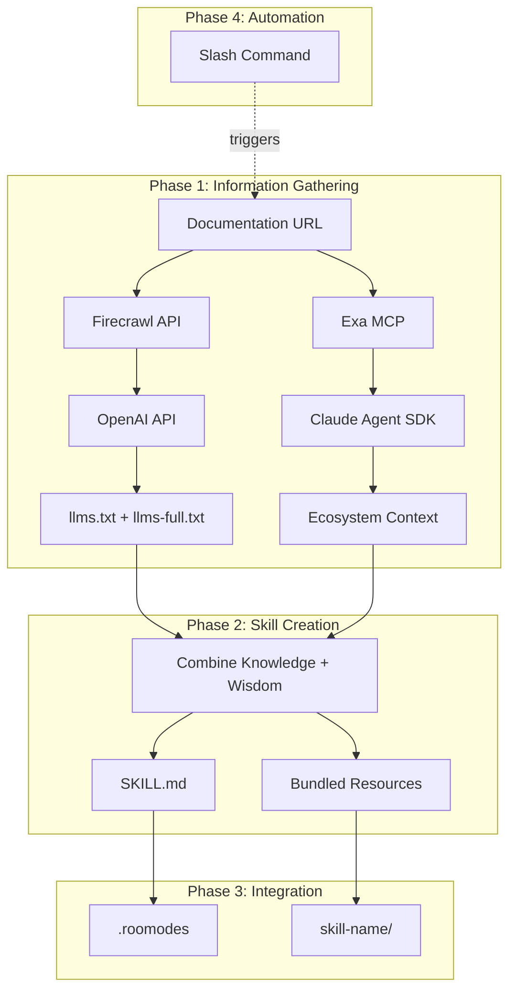

# Agent Skill Generator Process

## Overview

The Agent Skill Generator is a system that transforms web documentation into fully-integrated Roo Code skills. It combines automated knowledge extraction with ecosystem research to create high-quality Agent Skills that extend Roo Code's capabilities.

**Goal**: Enable Roo Code to autonomously learn new tools and services by ingesting their documentation and generating properly configured modes.

## Architecture



---

## Phase 1: Information Gathering

### 1.1 Knowledge Extraction (llms.txt Generation)

**Purpose**: Convert web documentation into structured, searchable knowledge.

**Reference Implementation**: [`create-llmstxt-py/generate-llmstxt.py`](../create-llmstxt-py/generate-llmstxt.py)

#### Process Flow

1. **Map Website Structure**
   - Uses Firecrawl `/map` endpoint to discover all URLs
   - Returns list of documentation pages
   - Configurable page limit (default: 20-100 pages)

2. **Scrape Content**
   - Uses Firecrawl `/scrape` endpoint for each URL
   - Extracts markdown content
   - Filters to main content only

3. **Generate Summaries**
   - Uses OpenAI to create titles (3-4 words)
   - Generates descriptions (9-10 words)
   - Batch processes for efficiency

4. **Output Files**
   - **llms.txt**: Index with titles and descriptions
   - **llms-full.txt**: Complete markdown content from all pages

#### Example Command

```bash
python create-llmstxt-py/generate-llmstxt.py \
  https://docs.example.com \
  --max-urls 50 \
  --output-dir ./temp-knowledge
```

#### Output Format

**llms.txt**:
```markdown
# https://docs.example.com llms.txt

- [Getting Started](https://docs.example.com/start): Quick setup guide for installation and basic usage
- [API Reference](https://docs.example.com/api): Complete API documentation with authentication and endpoints
- [Configuration](https://docs.example.com/config): Environment variables, settings, and deployment configuration
```

**llms-full.txt**:
```markdown
# https://docs.example.com llms-full.txt

## Getting Started
[Full markdown content from page 1...]

## API Reference
[Full markdown content from page 2...]

## Configuration
[Full markdown content from page 3...]
```

---

### 1.2 Ecosystem Research (Wisdom Generation)

**Purpose**: Understand where the tool fits in the broader ecosystem, common use cases, integration patterns, and best practices.

**Tools**:
- **Exa MCP Server**: For intelligent web research
- **Claude Agent SDK**: For orchestrating sequential research

#### Research Strategy: Sequential Feynman Process

The agent uses a multi-step research process to build deep understanding:

1. **Initial Discovery**
   - "What is [tool name]?"
   - "What problems does it solve?"
   - "Who are the main users?"

2. **Ecosystem Mapping**
   - "What tools does [tool] integrate with?"
   - "What are alternatives to [tool]?"
   - "What are common use cases for [tool]?"

3. **Best Practices**
   - "What are anti-patterns when using [tool]?"
   - "How do teams typically deploy [tool]?"
   - "What are security considerations for [tool]?"

4. **Edge Cases**
   - "What are common failure modes?"
   - "What are performance limitations?"
   - "What are compatibility concerns?"

#### Example Exa MCP Query Flow

```typescript
// Step 1: Discover the tool
const discovery = await exaMCP.search({
  query: "What is Supabase and what problems does it solve?",
  num_results: 5
});

// Step 2: Map ecosystem
const ecosystem = await exaMCP.search({
  query: "Supabase alternatives, integrations, and comparison with Firebase",
  num_results: 10
});

// Step 3: Gather best practices
const practices = await exaMCP.search({
  query: "Supabase production deployment best practices and security",
  num_results: 5
});
```

#### Output: Ecosystem Wisdom Document

```markdown
# [Tool Name] Ecosystem Context

## Overview
[2-3 paragraph synthesis of what the tool is and its purpose]

## Ecosystem Position
- **Category**: Database-as-a-Service
- **Alternatives**: Firebase, PlanetScale, Railway
- **Complements**: Next.js, React, TailwindCSS
- **Competitors**: Firebase, AWS Amplify

## Common Use Cases
1. Rapid prototyping with real-time subscriptions
2. Building SaaS applications with Row-Level Security
3. Serverless backends with Edge Functions

## Integration Patterns
- Works with: Vercel, Netlify, React, Next.js
- Auth providers: Google, GitHub, email/password
- Storage: S3-compatible object storage

## Best Practices
- Always implement Row-Level Security (RLS)
- Use connection pooling for serverless
- Leverage database functions for complex queries

## Common Pitfalls
- Not setting up RLS policies (security risk)
- Over-relying on client-side queries
- Ignoring database indexes for performance
```

---

## Phase 2: Skill Creation

### 2.1 Combine Knowledge + Wisdom

**Goal**: Merge structured documentation (llms.txt) with ecosystem context (wisdom) to create a comprehensive skill.

#### Synthesis Process

1. **Extract Core Capabilities**
   - Parse llms.txt for feature documentation
   - Identify main workflows and operations
   - Map to potential tool operations

2. **Enrich with Context**
   - Add ecosystem positioning from wisdom document
   - Include best practices and anti-patterns
   - Note integration patterns

3. **Structure as Skill**
   - Follow [`skill-creator/SKILL.md`](../skill-creator/SKILL.md) patterns
   - Create clear section hierarchy
   - Add examples and usage patterns

---

### 2.2 Generate SKILL.md

**Structure**: YAML frontmatter + Markdown instructions

#### YAML Frontmatter

```yaml
---
name: tool-name
description: This skill should be used when users need to [primary use case]. It provides [key capability 1], [key capability 2], and [key capability 3].
license: LICENSE.txt
metadata:
  source_url: https://docs.example.com
  generated_date: 2025-01-15
  generator_version: 1.0
  compatible_modes: ["code", "architect", "integration"]
  required_groups: ["read", "edit", "mcp"]
---
```

**Key Fields**:
- `name`: Matches skill folder name (kebab-case)
- `description`: Third-person, specific about when to use (used for skill discovery)
- `metadata.source_url`: Original documentation URL (for updates)
- `metadata.compatible_modes`: Which Roo modes work with this skill

#### Markdown Content

Follow the skill-creator pattern:

```markdown
# [Tool Name] Skill

[Brief overview paragraph from ecosystem wisdom]

## Core Capabilities

[List main features from llms.txt]

## When to Use This Skill

[Synthesized from wisdom document - common use cases]

## Workflow

### Step 1: [Setup/Configuration]
[Instructions from llms.txt]

### Step 2: [Primary Operations]
[Instructions from llms.txt]

### Step 3: [Integration]
[Instructions from llms.txt + ecosystem patterns]

## Best Practices

[From wisdom document]

## Common Patterns

[From ecosystem research]

## Examples

[Concrete examples from llms-full.txt]

## Troubleshooting

[Common pitfalls from wisdom + llms.txt]

## References

[Link to original docs and related resources]
```

---

### 2.3 Create Bundled Resources

**Optional but recommended** for complex skills.

#### Directory Structure

```
skill-name/
├── SKILL.md
├── LICENSE.txt
├── scripts/
│   └── helper-script.py       # Executable utilities
├── references/
│   ├── api-reference.md       # From llms-full.txt
│   └── schemas.md             # From documentation
└── assets/
    └── template.json          # Boilerplate files
```

#### When to Bundle Resources

**Scripts** (`scripts/`):
- Repetitive operations that need deterministic execution
- Example: Setup scripts, migration helpers, validation tools

**References** (`references/`):
- Large documentation sections (>10k words)
- API reference from llms-full.txt
- Schema definitions
- Configuration templates

**Assets** (`assets/`):
- Template files users will copy/modify
- Configuration examples
- Boilerplate code

#### Example: Extracting API Reference

```bash
# From llms-full.txt, extract API section
grep -A 500 "## API Reference" llms-full.txt > references/api-reference.md
```

---

## Phase 3: Mode Configuration

### 3.1 Create Mode Entry in .roomodes

**Goal**: Register the skill as a Roo Code mode.

#### Add Mode Definition

Reference: [`.roomodes`](../.roomodes:204-217)

```json
{
  "slug": "tool-name",
  "name": "🔧 Tool Name",
  "roleDefinition": "You are a [tool name] specialist who helps users [primary capability].",
  "skill_ref": {
    "path": "tool-name/SKILL.md",
    "merge_strategy": "override"
  },
  "groups": ["read", "edit", "mcp"],
  "source": "project"
}
```

**Key Configuration**:

- **slug**: Kebab-case identifier (matches skill folder)
- **name**: Display name with emoji (use relevant emoji)
- **roleDefinition**: Brief role statement (1-2 sentences)
- **skill_ref.path**: Relative path to SKILL.md
- **skill_ref.merge_strategy**: 
  - `override`: Use SKILL.md content only (recommended for generated skills)
  - `append`: Add SKILL.md after roleDefinition
  - `prepend`: Add SKILL.md before roleDefinition
- **groups**: Required permissions
  - `read`: File reading
  - `edit`: File modification
  - `browser`: Web automation
  - `mcp`: MCP server access
  - `command`: Terminal execution

#### Permission Guidelines

| Skill Type | Required Groups | Reasoning |
|------------|----------------|-----------|
| Documentation Reader | `["read"]` | Only needs to read files |
| Code Generator | `["read", "edit"]` | Reads context, writes code |
| API Client | `["read", "edit", "mcp"]` | Uses MCP server tools |
| CLI Tool | `["read", "edit", "command"]` | Executes terminal commands |
| Web Service | `["read", "edit", "browser"]` | Interacts with web UI |

---

### 3.2 Validation

After adding the mode, validate the configuration:

```bash
# Use the validation script
python scripts/validate_mode_skill_integration.py
```

**Validation Checks**:
- ✅ SKILL.md file exists at specified path
- ✅ YAML frontmatter is valid
- ✅ Mode groups align with skill's required_groups metadata
- ✅ No duplicate slugs in .roomodes
- ✅ File sizes under 500 lines (modular principle)

---

## Phase 4: Command Creation

### 4.1 Create Slash Command

**Goal**: Make skill generation reusable via slash command.

**Location**: `.roo/commands/generate-skill.md`

#### Command Template

```markdown
# generate-skill

Generate a new Agent Skill from documentation URL.

## Usage

```
/generate-skill <url> [options]
```

## Parameters

- `url`: Documentation website URL (required)
- `--name`: Skill name in kebab-case (optional, derived from URL if not provided)
- `--max-pages`: Maximum pages to scrape (default: 50)
- `--groups`: Comma-separated permission groups (default: "read,edit")

## Process

This command orchestrates the complete skill generation workflow:

1. **Extract Knowledge**
   - Maps documentation structure with Firecrawl
   - Scrapes and summarizes all pages
   - Generates llms.txt and llms-full.txt

2. **Research Ecosystem**
   - Uses Exa MCP to understand tool positioning
   - Identifies integration patterns and best practices
   - Documents common pitfalls and edge cases

3. **Create Skill**
   - Combines knowledge + wisdom into SKILL.md
   - Structures content following skill-creator patterns
   - Extracts references and assets as needed

4. **Configure Mode**
   - Adds entry to .roomodes with skill_ref
   - Sets appropriate permissions
   - Validates integration

5. **Verify**
   - Runs validation checks
   - Confirms mode is selectable
   - Tests basic skill loading

## Examples

Generate skill for Supabase:
```
/generate-skill https://supabase.com/docs --name supabase-admin --groups read,edit,mcp
```

Generate skill for Stripe:
```
/generate-skill https://stripe.com/docs --name stripe-integration --max-pages 100
```

## Output

- `{skill-name}/SKILL.md`: Main skill file
- `{skill-name}/references/`: Documentation extracts
- Updated `.roomodes` with new mode entry
- Validation report

## Notes

- Requires FIRECRAWL_API_KEY and OPENAI_API_KEY environment variables
- May take 5-15 minutes depending on documentation size
- Review generated SKILL.md before committing
```

---

### 4.2 Implementation Script

**Location**: `scripts/generate-skill.sh`

```bash
#!/bin/bash
set -e

# Parse arguments
URL=$1
SKILL_NAME=${2:-$(echo $URL | sed 's|https://||' | sed 's|/.*||' | sed 's|\.|-|g')}
MAX_PAGES=${3:-50}
GROUPS=${4:-"read,edit"}

echo "🔧 Generating Agent Skill: $SKILL_NAME"
echo "📄 Source: $URL"
echo "📊 Max Pages: $MAX_PAGES"

# Step 1: Generate llms.txt
echo "Step 1/5: Extracting knowledge..."
python create-llmstxt-py/generate-llmstxt.py \
  "$URL" \
  --max-urls "$MAX_PAGES" \
  --output-dir "./temp-$SKILL_NAME"

# Step 2: Research ecosystem (delegated to MCP mode)
echo "Step 2/5: Researching ecosystem..."
# TODO: Implement Exa MCP research flow
# This would use new_task to delegate to mcp mode

# Step 3: Generate SKILL.md
echo "Step 3/5: Creating SKILL.md..."
# TODO: Implement synthesis logic
# Combine llms.txt + wisdom into SKILL.md format

# Step 4: Add to .roomodes
echo "Step 4/5: Configuring mode..."
# TODO: Append mode entry to .roomodes

# Step 5: Validate
echo "Step 5/5: Validating..."
python scripts/validate_mode_skill_integration.py

echo "✅ Skill generation complete: $SKILL_NAME"
```

---

## Complete Workflow Example

### Scenario: Generate Skill for FastAPI

**Input**: Documentation URL `https://fastapi.tiangolo.com`

#### Step 1: Extract Knowledge

```bash
python create-llmstxt-py/generate-llmstxt.py \
  https://fastapi.tiangolo.com \
  --max-urls 50 \
  --output-dir ./temp-fastapi
```

**Output**:
- `temp-fastapi/fastapi.tiangolo.com-llms.txt` (index)
- `temp-fastapi/fastapi.tiangolo.com-llms-full.txt` (full content)

#### Step 2: Research Ecosystem

Use MCP mode with Exa MCP server:

```
/new-task mcp "Research FastAPI ecosystem: alternatives, integrations, best practices, and common pitfalls"
```

**Output**: `temp-fastapi/ecosystem-wisdom.md`

#### Step 3: Generate SKILL.md

Combine knowledge + wisdom:

```markdown
---
name: fastapi
description: This skill should be used when building REST APIs with FastAPI. It provides automatic API documentation, type validation, and async request handling.
license: LICENSE.txt
metadata:
  source_url: https://fastapi.tiangolo.com
  compatible_modes: ["code", "architect", "integration"]
  required_groups: ["read", "edit"]
---

# FastAPI Skill

FastAPI is a modern, fast web framework for building APIs with Python 3.7+ based on standard Python type hints.

## Core Capabilities

- Automatic interactive API documentation (Swagger UI)
- Type validation using Pydantic
- Async request handling
- Dependency injection system
- OAuth2 and JWT authentication

[... rest of skill content ...]
```

#### Step 4: Configure Mode

Add to `.roomodes`:

```json
{
  "slug": "fastapi",
  "name": "⚡ FastAPI",
  "roleDefinition": "You are a FastAPI specialist who builds high-performance REST APIs with automatic documentation and type validation.",
  "skill_ref": {
    "path": "fastapi/SKILL.md",
    "merge_strategy": "override"
  },
  "groups": ["read", "edit"],
  "source": "project"
}
```

#### Step 5: Validate

```bash
python scripts/validate_mode_skill_integration.py
```

**Output**:
```
✅ Validation complete
✅ fastapi/SKILL.md exists
✅ YAML frontmatter valid
✅ Mode groups compatible
✅ No duplicate slugs
✅ SKILL.md under 500 lines
```

---

## Best Practices

### Knowledge Extraction

- **Start small**: Begin with 20-50 pages to test quality
- **Verify summaries**: Review OpenAI-generated descriptions for accuracy
- **Filter noise**: Exclude changelog, blog posts, and marketing pages
- **Preserve structure**: Maintain documentation hierarchy in llms.txt

### Ecosystem Research

- **Sequential depth**: Start broad, then drill into specifics
- **Cross-reference**: Validate claims across multiple sources
- **Update regularly**: Ecosystems change; plan for re-generation
- **Capture nuance**: Document both strengths and limitations

### Skill Creation

- **Follow patterns**: Use skill-creator guidelines consistently
- **Stay modular**: Keep SKILL.md under 500 lines
- **Include examples**: Concrete examples aid understanding
- **Document sources**: Always link back to original docs

### Mode Integration

- **Minimal permissions**: Grant only necessary groups
- **Clear naming**: Use descriptive slugs and display names
- **Test thoroughly**: Validate mode switching and skill loading
- **Version control**: Track changes to .roomodes

---

## Troubleshooting

### Common Issues

**Firecrawl returns empty content**
- Check if site requires authentication
- Verify site allows scraping (robots.txt)
- Try increasing timeout parameter

**OpenAI summaries are generic**
- Reduce content chunk size for more focused summaries
- Adjust temperature parameter (lower = more consistent)
- Review prompt engineering in generate-llmstxt.py

**SKILL.md exceeds 500 lines**
- Move detailed documentation to `references/`
- Extract examples to separate files
- Focus on workflow guidance in SKILL.md

**Mode fails to load skill**
- Verify skill_ref path is correct (relative to workspace)
- Check YAML frontmatter syntax
- Ensure SKILL.md has both frontmatter and content

**Permission errors**
- Verify groups array includes necessary permissions
- Check if skill requires MCP server access
- Review file pattern restrictions for mode

---

## Future Enhancements

### Automated Updates

Monitor documentation changes and trigger re-generation:

```bash
# Cron job to check for updates
0 0 * * 0 /scripts/check-docs-updates.sh
```

### Quality Scoring

Implement scoring system for generated skills:

- Knowledge coverage (% of docs included)
- Ecosystem depth (research quality)
- Example completeness
- User feedback ratings

### Multi-Source Synthesis

Combine multiple documentation sources:

- Official docs
- Community guides
- API specifications
- Example repositories

### Interactive Generation

Web UI for skill generation:

- Documentation URL input
- Live preview of llms.txt
- Manual wisdom editing
- SKILL.md customization
- One-click integration

---

## Related Documentation

- [Roo Code ↔ Claude Skills Integration](./roo-claude-skills-integration.md)
- [Skill Creator Guide](../skill-creator/SKILL.md)
- [Mode Configuration Reference](../.roomodes)
- [MCP Server Integration](../mcp-builder/SKILL.md)

---

## Summary

The Agent Skill Generator process transforms web documentation into fully-integrated Roo Code skills through a four-phase workflow:

1. **Information Gathering**: Extract knowledge (llms.txt) and research ecosystem (wisdom)
2. **Skill Creation**: Combine knowledge + wisdom into structured SKILL.md
3. **Mode Configuration**: Register skill in .roomodes with appropriate permissions
4. **Command Creation**: Enable reusable generation via slash command

This automated approach enables Roo Code to continuously expand its capabilities by learning from documentation, making it a self-improving coding agent.