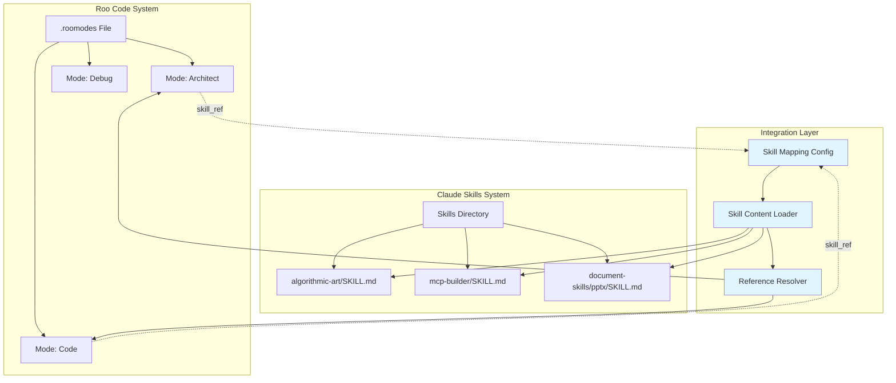
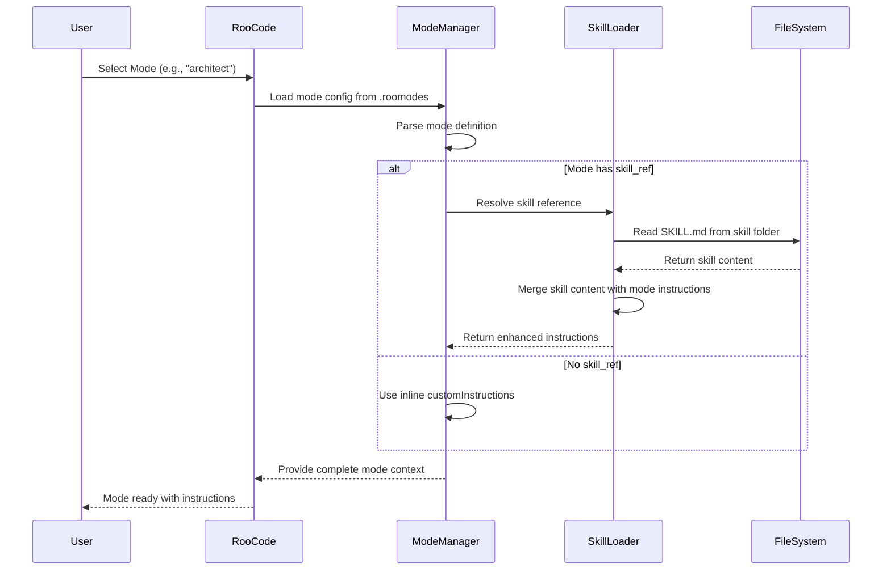
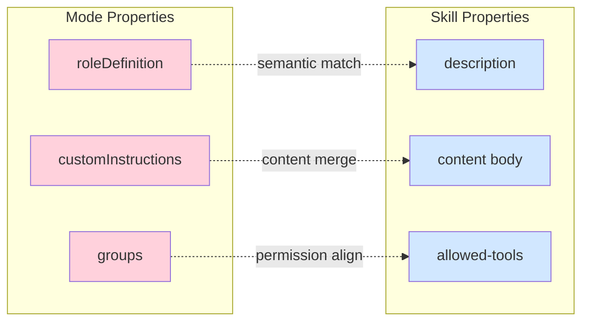
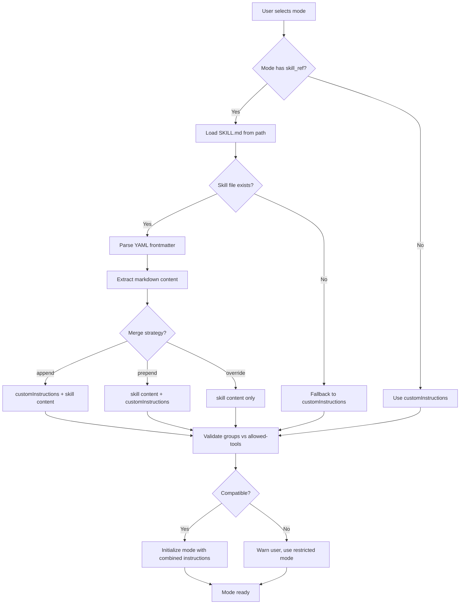
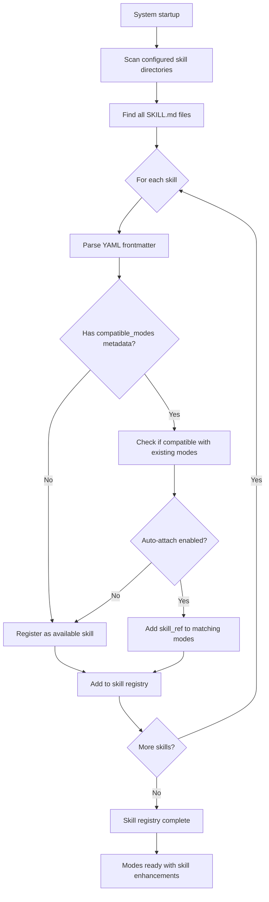
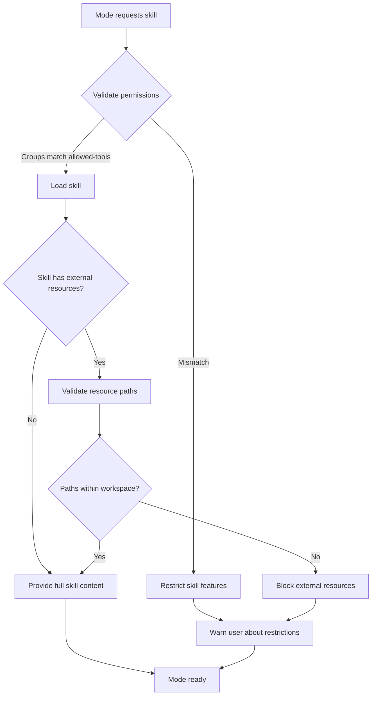

# Roo Code ↔ Claude Skills Integration Architecture

## Executive Summary

This document defines an integration pattern that bridges Roo Code's `.roomodes` custom mode system with Claude's Agent Skills specification. The architecture enables bidirectional interoperability while maintaining modularity, avoiding hardcoded values, and preserving each system's independence.

---

## Current State Analysis

### Roo Code Modes (`.roomodes`)

**Structure**: JSON-based mode definitions
```json
{
  "customModes": [
    {
      "slug": "mode-identifier",
      "name": "🎯 Display Name",
      "roleDefinition": "Core role description",
      "customInstructions": "Detailed behavioral instructions",
      "groups": ["read", "edit", "browser", "mcp", "command"],
      "source": "project|global"
    }
  ]
}
```

**Key Characteristics**:
- Inline instruction storage in JSON
- Permission-based tool access via groups
- Emoji-prefixed names for UX
- Mode-specific constraints (e.g., file pattern restrictions)

### Claude Skills (`SKILL.md`)

**Structure**: YAML frontmatter + Markdown content
```yaml
---
name: skill-name
description: When to use this skill
license: LICENSE.txt
allowed-tools: [tool1, tool2]
metadata:
  custom_key: value
---

# Skill Content
Detailed instructions in markdown...
```

**Key Characteristics**:
- Folder-based organization
- External resource references (scripts, templates, schemas)
- Tool pre-approval system
- Discoverable via directory scanning

---

## Integration Architecture

### Design Principles

1. **Separation of Concerns**: Modes remain in `.roomodes`, skills in skill folders
2. **Reference-Based Linking**: Modes reference skills, not duplicate content
3. **Bidirectional Discovery**: Either system can leverage the other
4. **No Hardcoded Values**: All paths and references configurable
5. **Extensibility**: New modes can reference existing skills; new skills auto-available

### Architecture Diagram



### Data Flow: Mode Initialization with Skill Content



---

## Proposed Integration Pattern

### Pattern 1: Skill Reference in Mode Definition

Extend `.roomodes` schema to support skill references:

```json
{
  "customModes": [
    {
      "slug": "architect",
      "name": "🏗️ Architect",
      "roleDefinition": "You design scalable, secure architectures",
      "customInstructions": "Base instructions for architect mode",
      "skill_refs": [
        {
          "path": "canvas-design/SKILL.md",
          "merge_strategy": "append",
          "priority": 10
        }
      ],
      "groups": ["read", "edit"],
      "source": "project"
    }
  ]
}
```

**`skill_refs` Properties**:
- `path`: Relative path to SKILL.md file
- `merge_strategy`: How to combine skill content with customInstructions
  - `append`: Add skill content after customInstructions
  - `prepend`: Add skill content before customInstructions
  - `override`: Replace customInstructions with skill content
- `priority`: Loading order when multiple skills referenced (lower = first)

### Pattern 2: Skill Metadata for Mode Compatibility

Extend SKILL.md metadata to declare mode compatibility:

```yaml
---
name: canvas-design
description: Design visual compositions using HTML canvas
license: LICENSE.txt
metadata:
  compatible_modes: ["architect", "code", "docs-writer"]
  required_groups: ["read", "edit"]
  suggests_groups: ["browser"]
  roo_integration_version: "1.0"
---

# Canvas Design Skill
...skill instructions...
```

### Pattern 3: Dynamic Skill Discovery

Create a skill registry that scans skill directories and makes them available to modes:

```json
{
  "skill_registry": {
    "base_path": "./",
    "scan_patterns": ["*/SKILL.md", "*/*/SKILL.md"],
    "cache_enabled": true,
    "cache_ttl": 3600
  }
}
```

---

## Mapping Relationships

### Conceptual Mapping: Mode ↔ Skill



### Recommended Mappings

| Roo Mode Property | Claude Skill Property | Integration Strategy |
|-------------------|----------------------|---------------------|
| `roleDefinition` | `description` | Use skill description to enhance role clarity |
| `customInstructions` | Markdown content | Merge or reference skill content |
| `groups` | `allowed-tools` | Validate tool compatibility |
| `name` | `name` | Optional: auto-generate mode names from skills |
| `slug` | `name` | Optional: derive slug from skill name |

---

## Implementation Strategies

### Strategy A: Reference-Based (Recommended)

**Approach**: Modes reference skills via path, content loaded dynamically

**Benefits**:
- No content duplication
- Single source of truth for skill instructions
- Automatic updates when skills change
- Smaller `.roomodes` file

**Implementation**:
```json
{
  "slug": "algorithmic-art-mode",
  "name": "🎨 Algorithmic Artist",
  "roleDefinition": "Create generative art using algorithms",
  "skill_refs": [
    {
      "path": "algorithmic-art/SKILL.md",
      "merge_strategy": "override"
    }
  ],
  "groups": ["read", "edit", "browser"]
}
```

**Runtime Behavior**:
1. Mode manager reads `.roomodes`
2. Detects `skill_refs` array
3. Loads SKILL.md content from path
4. Merges according to strategy
5. Provides combined instructions to agent

### Strategy B: Skill-Generated Modes

**Approach**: Generate `.roomodes` entries from SKILL.md files

**Benefits**:
- Auto-discover new modes from skills
- Consistency between skill and mode
- Less manual configuration

**Implementation**:
```bash
# Command to generate mode from skill
roo-generate-mode --skill algorithmic-art --output .roomodes
```

**Generated Entry**:
```json
{
  "slug": "algorithmic-art",
  "name": "🎨 Algorithmic Art",
  "roleDefinition": "Creating algorithmic art using p5.js...",
  "customInstructions": "[Content from SKILL.md]",
  "groups": ["read", "edit", "browser"],
  "source": "skill-generated",
  "skill_source": "algorithmic-art/SKILL.md"
}
```

### Strategy C: Hybrid Approach

**Approach**: Support both inline modes and skill-referenced modes

**Benefits**:
- Maximum flexibility
- Gradual migration path
- Support legacy and new patterns

**Configuration**:
```json
{
  "customModes": [
    {
      "slug": "architect",
      "name": "🏗️ Architect",
      "roleDefinition": "Design scalable architectures",
      "customInstructions": "Inline instructions here",
      "groups": ["read", "edit"]
    },
    {
      "slug": "canvas-designer",
      "name": "🎨 Canvas Designer",
      "skill_ref": "canvas-design/SKILL.md",
      "groups": ["read", "edit", "browser"]
    }
  ],
  "skill_integration": {
    "enabled": true,
    "fallback_to_inline": true,
    "cache_skill_content": true
  }
}
```

---

## Integration Workflow

### Workflow 1: User Selects Mode with Skill Reference



### Workflow 2: Skill Discovery and Auto-Registration



---

## Configuration Schema

### Extended `.roomodes` Schema

```typescript
interface RooModesConfig {
  customModes: CustomMode[];
  skill_integration?: SkillIntegration;
}

interface CustomMode {
  slug: string;
  name: string;
  roleDefinition: string;
  customInstructions?: string;
  skill_refs?: SkillReference[];
  groups: PermissionGroup[];
  source: "project" | "global" | "skill-generated";
}

interface SkillReference {
  path: string;                    // Relative to workspace root
  merge_strategy: "append" | "prepend" | "override";
  priority?: number;               // Load order (default: 100)
  conditions?: {                   // Optional conditional loading
    env_var?: string;
    file_exists?: string;
  };
}

interface SkillIntegration {
  enabled: boolean;
  base_path: string;               // Where to find skills (default: "./")
  scan_patterns: string[];         // Glob patterns for SKILL.md
  cache_enabled: boolean;
  cache_ttl: number;               // Cache duration in seconds
  auto_discover: boolean;          // Auto-add skills to registry
  fallback_to_inline: boolean;     // Use customInstructions if skill load fails
}

type PermissionGroup = "read" | "edit" | "browser" | "mcp" | "command";
```

### Extended SKILL.md Metadata Schema

```yaml
---
name: skill-name                   # Required: matches folder name
description: When to use           # Required: agent discovery hint

license: LICENSE.txt               # Optional: license reference
allowed-tools: [tool1, tool2]      # Optional: Claude-specific

metadata:                          # Optional: extensible metadata
  # Roo Code Integration
  compatible_modes:                # Modes this skill works with
    - architect
    - code
  required_groups:                 # Minimum permissions needed
    - read
    - edit
  suggests_groups:                 # Recommended additional permissions
    - browser
  
  # Versioning
  roo_integration_version: "1.0"   # Integration spec version
  skill_version: "2.1.0"           # Skill content version
  
  # Custom extensions
  custom_key: custom_value
---

# Skill Content
...markdown instructions...
```

---

## Example Integration Scenarios

### Scenario 1: Architect Mode References Canvas Design Skill

**Before** (`.roomodes`):
```json
{
  "slug": "architect",
  "name": "🏗️ Architect",
  "roleDefinition": "You design scalable, secure architectures",
  "customInstructions": "Create architecture mermaid diagrams..."
}
```

**After** (with skill reference):
```json
{
  "slug": "architect",
  "name": "🏗️ Architect",
  "roleDefinition": "You design scalable, secure architectures",
  "customInstructions": "Create architecture mermaid diagrams...",
  "skill_refs": [
    {
      "path": "canvas-design/SKILL.md",
      "merge_strategy": "append",
      "priority": 10
    }
  ]
}
```

**Runtime Result**:
- Mode gets base architectural instructions
- Plus canvas design expertise from skill
- Agent can create both architecture diagrams AND visual designs

### Scenario 2: Auto-Generated Mode from MCP Builder Skill

**Skill** (`mcp-builder/SKILL.md`):
```yaml
---
name: mcp-builder
description: Build and evaluate MCP servers
metadata:
  compatible_modes: ["code", "integration"]
  required_groups: ["read", "edit", "command"]
  auto_generate_mode: true
  suggested_mode_name: "🔧 MCP Builder"
---

# MCP Server Builder
Instructions for building MCP servers...
```

**Auto-Generated Mode**:
```json
{
  "slug": "mcp-builder",
  "name": "🔧 MCP Builder",
  "roleDefinition": "Build and evaluate MCP servers",
  "skill_refs": [
    {
      "path": "mcp-builder/SKILL.md",
      "merge_strategy": "override"
    }
  ],
  "groups": ["read", "edit", "command"],
  "source": "skill-generated"
}
```

### Scenario 3: Mode with Multiple Skills

**Complex Mode** (combining multiple skills):
```json
{
  "slug": "full-stack-developer",
  "name": "💻 Full Stack Dev",
  "roleDefinition": "Build complete web applications",
  "skill_refs": [
    {
      "path": "canvas-design/SKILL.md",
      "merge_strategy": "append",
      "priority": 10
    },
    {
      "path": "document-skills/docx/SKILL.md",
      "merge_strategy": "append",
      "priority": 20
    },
    {
      "path": "mcp-builder/SKILL.md",
      "merge_strategy": "append",
      "priority": 30
    }
  ],
  "groups": ["read", "edit", "browser", "mcp", "command"]
}
```

**Effective Instructions** = Base roleDefinition + Canvas Design + DOCX Skills + MCP Building

---

## Migration Path

### Phase 1: Add Reference Support (Non-Breaking)

1. Extend `.roomodes` parser to recognize `skill_refs`
2. Implement skill content loader
3. Support merge strategies
4. Maintain backward compatibility (modes without skill_refs work as before)

### Phase 2: Skill Discovery Registry

1. Implement skill scanning on startup
2. Build in-memory skill registry
3. Expose skill list to mode configuration
4. Add validation for skill compatibility

### Phase 3: Auto-Generation (Optional)

1. Add CLI tool for mode generation from skills
2. Support skill metadata for mode preferences
3. Enable auto-discovery of new skills
4. Generate mode entries automatically

### Phase 4: Bidirectional Sync (Advanced)

1. Skills can declare mode requirements
2. Modes can advertise skill compatibility
3. Automatic suggestion system
4. Validation warnings for mismatches

---

## Security Considerations

### Access Control



**Validation Rules**:
1. **Permission Matching**: Mode `groups` must include skill's `required_groups`
2. **Path Restrictions**: Skill resources must be within workspace directory
3. **No Hardcoded Secrets**: Validate skill content doesn't contain credentials
4. **Tool Allowlisting**: Only pre-approved tools from `allowed-tools` are available

### Environment Safety

- **No Hardcoded Values**: All paths configurable via environment or config
- **Relative Paths Only**: Skills reference resources relatively
- **Sandboxed Execution**: Skills cannot access system resources
- **Content Validation**: Parse and validate SKILL.md before loading

---

## Performance Optimization

### Caching Strategy

```typescript
interface SkillCache {
  content: Map<string, SkillContent>;  // Path → parsed content
  timestamps: Map<string, number>;     // Path → last modified
  ttl: number;                         // Cache time-to-live
}

function loadSkill(path: string): SkillContent {
  const cached = cache.content.get(path);
  const lastModified = fs.statSync(path).mtimeMs;
  
  if (cached && cache.timestamps.get(path) === lastModified) {
    return cached;  // Use cached version
  }
  
  const content = parseSkillFile(path);
  cache.content.set(path, content);
  cache.timestamps.set(path, lastModified);
  
  return content;
}
```

**Optimization Techniques**:
1. **Lazy Loading**: Load skills only when mode is activated
2. **Content Caching**: Cache parsed skill content
3. **File Watching**: Invalidate cache when SKILL.md changes
4. **Parallel Loading**: Load multiple skills concurrently
5. **Incremental Parsing**: Parse only needed sections

---

## Testing Strategy

### Unit Tests

```typescript
describe('Skill Integration', () => {
  test('loads skill content from valid path', () => {
    const mode = {
      slug: 'test-mode',
      skill_refs: [{ path: 'test-skill/SKILL.md', merge_strategy: 'append' }]
    };
    const result = loadSkillContent(mode);
    expect(result).toContain('test skill content');
  });
  
  test('merges skills according to strategy', () => {
    const mode = {
      customInstructions: 'Base instructions',
      skill_refs: [
        { path: 'skill1/SKILL.md', merge_strategy: 'prepend' },
        { path: 'skill2/SKILL.md', merge_strategy: 'append' }
      ]
    };
    const result = mergeSkills(mode);
    expect(result).toBe('skill1 content\nBase instructions\nskill2 content');
  });
  
  test('validates permission compatibility', () => {
    const mode = { groups: ['read'] };
    const skill = { metadata: { required_groups: ['read', 'edit'] } };
    expect(validateCompatibility(mode, skill)).toBe(false);
  });
});
```

### Integration Tests

```typescript
describe('End-to-End Skill Loading', () => {
  test('mode with skill reference loads correctly', () => {
    const workspace = createTestWorkspace();
    const modeManager = new ModeManager(workspace);
    const mode = modeManager.loadMode('architect');
    
    expect(mode.instructions).toContain('canvas design');
    expect(mode.permissions).toContain('browser');
  });
  
  test('skill discovery finds all SKILL.md files', () => {
    const registry = new SkillRegistry('./skills');
    const skills = registry.scan();
    
    expect(skills.length).toBeGreaterThan(0);
    expect(skills.map(s => s.name)).toContain('algorithmic-art');
  });
});
```

---

## Tooling & Developer Experience

### CLI Commands

```bash
# List available skills
roo-skills list

# Show skill details
roo-skills show algorithmic-art

# Validate skill format
roo-skills validate canvas-design/SKILL.md

# Generate mode from skill
roo-skills generate-mode --skill mcp-builder --output .roomodes

# Check mode-skill compatibility
roo-skills check-compatibility --mode architect --skill canvas-design

# Cache management
roo-skills cache clear
roo-skills cache stats
```

### IDE Integration

- **Auto-completion**: Suggest available skills when editing `.roomodes`
- **Validation**: Highlight invalid skill references
- **Preview**: Show merged instructions before mode activation
- **Navigation**: Jump from skill_ref to SKILL.md file

---

## Future Extensions

### Advanced Features

1. **Conditional Loading**
   ```json
   {
     "skill_refs": [
       {
         "path": "advanced-skill/SKILL.md",
         "conditions": {
           "env_var": "ENABLE_ADVANCED_FEATURES",
           "file_exists": "config/advanced.json"
         }
       }
     ]
   }
   ```

2. **Skill Versioning**
   ```yaml
   ---
   name: mcp-builder
   skill_version: 2.1.0
   min_roo_version: 1.5.0
   ---
   ```

3. **Skill Dependencies**
   ```yaml
   ---
   name: full-stack-skill
   dependencies:
     - canvas-design >=1.0
     - mcp-builder ^2.0
   ---
   ```

4. **Dynamic Skill Injection**
   - Inject skills at runtime based on file types
   - Context-aware skill suggestions
   - Smart skill recommendations

---

## Conclusion

This integration architecture provides a robust, extensible bridge between Roo Code modes and Claude Skills. The reference-based approach maintains separation of concerns while enabling powerful composition of capabilities. The design prioritizes:

- ✅ **Modularity**: Each system remains independent
- ✅ **Extensibility**: Easy to add new skills and modes
- ✅ **Security**: Proper validation and sandboxing
- ✅ **Performance**: Caching and lazy loading
- ✅ **Developer Experience**: Clear APIs and tooling

The phased migration path allows gradual adoption without breaking existing functionality.