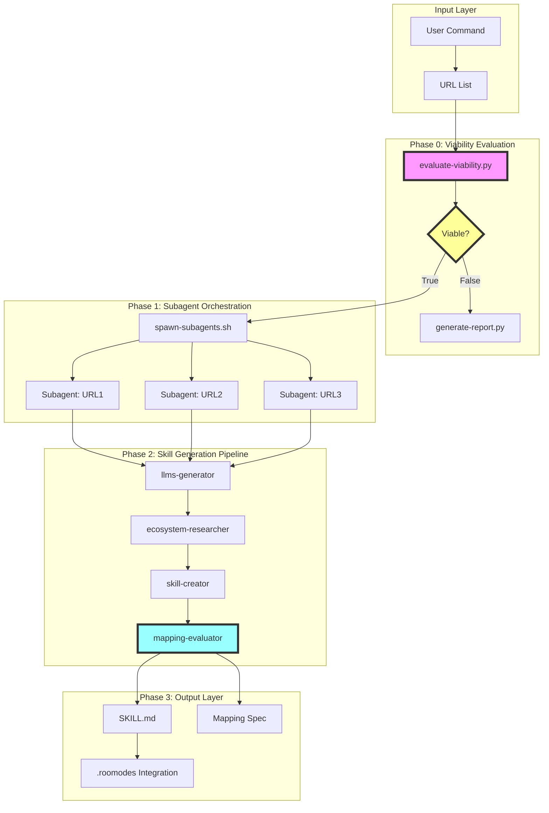

# Enhanced Skill Generator Pipeline with Viability Evaluation

**Quick Navigation:**
- [Executive Summary](#executive-summary)
- [Design Principles](#design-principles)
- [Architecture Overview](#architecture-overview)
- [Phase 0: Viability Evaluation](#phase-0-viability-evaluation)
- [Enhanced /generate-skill Command](#enhanced-generate-skill-command)
- [Mapping Phase Integration](#mapping-phase-integration)
- [Pipeline Composition Examples](#pipeline-composition-examples)
- [File Structure](#file-structure-after-enhanced-pipeline)
- [Success Criteria](#success-criteria)

## Executive Summary

This specification enhances the existing Agent Skill Generator system with:

1. **Unix-Inspired Architecture** - Atomic, composable scripts with stdin/stdout piping
2. **Viability Evaluation Phase** - Automated assessment before expensive skill generation
3. **Parallel Multi-URL Processing** - Spawn one subagent per URL for concurrent generation
4. **Mapping Phase Integration** - Programmatic coding agent extensibility mapping (Cursor, Windsurf, Cline, etc.)
5. **Report Generation** - Structured viability reports for non-viable products

## Design Principles

### 1. Unix Philosophy

> "Write programs that do one thing and do it well. Write programs to work together. Write programs to handle text streams, because that is a universal interface."

**Applied to Skill Generation:**
- Each phase is an atomic script with single responsibility
- JSON as universal interchange format
- Composable via pipes: `phase1 | phase2 | phase3`
- Exit codes indicate success/failure
- idempotent operations where possible

### 2. Atomic Composability

```bash
# Each script can run standalone
./evaluate-viability.py https://cursor.com > viability.json
cat viability.json | ./generate-skill.py
cat viability.json | ./generate-report.md

# Or composed in pipeline
./evaluate-viability.py https://cursor.com | \
  tee viability.json | \
  ./generate-skill.py
```

### 3. Parallel Subagent Processing

```bash
# Multiple URLs spawn independent subagents
./generate-skill-batch.sh \
  https://cursor.com \
  https://windsurf.com \
  https://cline.bot

# Each URL gets dedicated Claude Agent SDK subagent
# Results aggregated at end
```

## Architecture Overview



## Phase 0: Viability Evaluation

### Purpose

Quickly assess if a product/service has sufficient extensibility to support Skills/Modes before expensive scraping and generation.

### Script: `evaluate-viability.py`

**Interface:**
```bash
# Stdin: None
# Stdout: JSON viability assessment
# Exit: 0 (viable), 1 (non-viable), 2 (error)

./evaluate-viability.py <URL> [--timeout 60] [--format json|yaml]
```

**Implementation:**

```python
#!/usr/bin/env python3
"""
Viability Evaluator - Atomic script for assessing coding agent extensibility.

Outputs JSON to stdout with viability determination and reasoning.
"""

import sys
import json
import argparse
from dataclasses import dataclass, asdict
from typing import List, Dict
from anthropic import Anthropic
from exa_py import Exa  # Exa API for research

@dataclass
class ViabilityResult:
    """Structured viability assessment."""
    url: str
    product_name: str
    viable: bool
    confidence: float  # 0.0-1.0
    reasoning: List[str]
    extensibility_mechanisms: List[str]
    mapping_strategy: str  # "skills", "rules", "commands", "hybrid", "impossible"
    estimated_fidelity: float  # 0.0-1.0 expected quality of mapping
    limitations: List[str]
    requirements: List[str]  # Prerequisites for successful mapping

def evaluate_viability(url: str, timeout: int = 60) -> ViabilityResult:
    """
    Evaluate if a coding agent has extensibility mechanisms for Skills.

    Research strategy:
    1. Quick documentation scan (Exa search)
    2. Look for: plugins, extensions, rules, commands, configuration
    3. Assess complexity and similarity to known patterns
    4. Return structured assessment
    """

    client = Anthropic()
    exa = Exa(api_key=os.getenv("EXA_API_KEY"))

    # Step 1: Quick reconnaissance
    search_results = exa.search_and_contents(
        f"site:{url} extensibility plugins configuration customization",
        num_results=5,
        text={"max_characters": 2000}
    )

    # Step 2: Analyze with Claude
    prompt = f"""
Analyze if this coding agent/IDE has extensibility mechanisms that could support
Agent Skills or Modes (like Claude Code Skills or Roo Code Modes).

Product: {url}
Documentation snippets:
{json.dumps([r.text for r in search_results.results], indent=2)}

Evaluate:
1. Does it have plugin/extension/rule systems?
2. Can users define custom behaviors/workflows?
3. What file formats and locations? (.cursor/rules, .config/, etc.)
4. Similarity to known patterns (Claude Skills, Cursor Rules, VS Code extensions)
5. Estimated mapping fidelity if we tried to convert Skills

Output JSON with structure:
{{
    "product_name": "Product Name",
    "viable": true/false,
    "confidence": 0.0-1.0,
    "reasoning": ["reason1", "reason2"],
    "extensibility_mechanisms": ["mechanism1", "mechanism2"],
    "mapping_strategy": "skills|rules|commands|hybrid|impossible",
    "estimated_fidelity": 0.0-1.0,
    "limitations": ["limitation1"],
    "requirements": ["requirement1"]
}}
"""

    response = client.messages.create(
        model="claude-sonnet-4-5-20250929",
        max_tokens=2048,
        messages=[{"role": "user", "content": prompt}]
    )

    # Parse Claude's JSON response
    assessment = json.loads(response.content[0].text)

    return ViabilityResult(
        url=url,
        product_name=assessment["product_name"],
        viable=assessment["viable"],
        confidence=assessment["confidence"],
        reasoning=assessment["reasoning"],
        extensibility_mechanisms=assessment["extensibility_mechanisms"],
        mapping_strategy=assessment["mapping_strategy"],
        estimated_fidelity=assessment["estimated_fidelity"],
        limitations=assessment["limitations"],
        requirements=assessment["requirements"]
    )

def main():
    parser = argparse.ArgumentParser(
        description="Evaluate viability of Skills mapping for coding agents"
    )
    parser.add_argument("url", help="Product documentation URL")
    parser.add_argument("--timeout", type=int, default=60, help="Timeout in seconds")
    parser.add_argument("--format", choices=["json", "yaml"], default="json")

    args = parser.parse_args()

    try:
        result = evaluate_viability(args.url, args.timeout)

        # Output to stdout
        if args.format == "json":
            print(json.dumps(asdict(result), indent=2))
        elif args.format == "yaml":
            import yaml
            print(yaml.dump(asdict(result), default_flow_style=False))

        # Exit code indicates viability
        sys.exit(0 if result.viable else 1)

    except Exception as e:
        error_result = {
            "error": str(e),
            "url": args.url,
            "viable": False,
            "confidence": 0.0
        }
        print(json.dumps(error_result, indent=2), file=sys.stderr)
        sys.exit(2)

if __name__ == "__main__":
    main()
```

**Example Usage:**

```bash
# Evaluate single URL
./evaluate-viability.py https://cursor.com > cursor-viability.json

# Check exit code
if [ $? -eq 0 ]; then
  echo "✅ Viable for Skills mapping"
  cat cursor-viability.json | ./generate-skill.py
else
  echo "❌ Not viable, generating report instead"
  cat cursor-viability.json | ./generate-report.py
fi

# Batch evaluation
for url in cursor.com windsurf.com cline.bot; do
  ./evaluate-viability.py "https://$url" | \
    jq -r 'select(.viable==true) | .url' >> viable-urls.txt
done
```

**Example Output:**

```json
{
  "url": "https://cursor.com",
  "product_name": "Cursor IDE",
  "viable": true,
  "confidence": 0.95,
  "reasoning": [
    "Has .cursor/rules system for project-specific instructions",
    "Supports .cursor/commands for slash commands",
    "MDC file format similar to Skills YAML frontmatter",
    "Three rule types: Always, Auto Attached, Manual",
    "Team Rules for organization-wide enforcement"
  ],
  "extensibility_mechanisms": [
    ".cursor/rules/*.mdc",
    ".cursor/commands/*.md",
    "AGENTS.md (simple alternative)",
    "Team Rules (dashboard-managed)"
  ],
  "mapping_strategy": "hybrid",
  "estimated_fidelity": 0.85,
  "limitations": [
    "No allowed-tools equivalent (cannot restrict tool access)",
    "No script bundling (scripts must be external)",
    "Commands are user-invoked, not model-invoked"
  ],
  "requirements": [
    "Convert YAML frontmatter to MDC format",
    "Map Skills description to Rules description + globs",
    "Create Commands for workflow skills",
    "Handle references as separate files with @ syntax"
  ]
}
```

### Report Generator for Non-Viable Products

**Script: `generate-report.py`**

```python
#!/usr/bin/env python3
"""
Report Generator - Create markdown report for non-viable products.

Stdin: ViabilityResult JSON
Stdout: Markdown report
"""

import sys
import json
from datetime import datetime

def generate_report(viability_data: dict) -> str:
    """Generate markdown report from viability assessment."""

    report = f"""# Skills Mapping Viability Report: {viability_data['product_name']}

**Generated:** {datetime.utcnow().isoformat()}Z
**Source:** {viability_data['url']}
**Assessment:** {'✅ VIABLE' if viability_data['viable'] else '❌ NOT VIABLE'}
**Confidence:** {viability_data['confidence']:.0%}

## Executive Summary

{viability_data['product_name']} has been evaluated for compatibility with Agent Skills mapping.

**Verdict:** {'This product has sufficient extensibility mechanisms to support Skills mapping.' if viability_data['viable'] else 'This product lacks the necessary extensibility mechanisms for effective Skills mapping.'}

## Viability Analysis

### Extensibility Mechanisms Found

"""

    if viability_data['extensibility_mechanisms']:
        for mechanism in viability_data['extensibility_mechanisms']:
            report += f"- {mechanism}\n"
    else:
        report += "*None identified*\n"

    report += f"""
### Mapping Strategy

**Recommended Approach:** {viability_data['mapping_strategy']}

**Estimated Fidelity:** {viability_data['estimated_fidelity']:.0%}

### Reasoning

"""

    for reason in viability_data['reasoning']:
        report += f"- {reason}\n"

    report += f"""
## Limitations

"""

    if viability_data['limitations']:
        for limitation in viability_data['limitations']:
            report += f"- {limitation}\n"
    else:
        report += "*No significant limitations identified*\n"

    if not viability_data['viable']:
        report += f"""
## Recommendation

Due to the lack of sufficient extensibility mechanisms, we recommend:

1. **Monitor for updates** - Check if future versions add plugin/extension systems
2. **Alternative approaches** - Consider wrapper scripts or external tooling
3. **Direct integration** - For high-priority products, explore API-based integration
4. **Community engagement** - Request extensibility features from maintainers

## Non-Trivial Problems

The fundamental challenges preventing Skills mapping:

"""
        # Extract key blockers
        critical_limitations = [l for l in viability_data['limitations']
                              if any(word in l.lower() for word in ['no', 'lacks', 'cannot', 'missing'])]

        for i, limitation in enumerate(critical_limitations, 1):
            report += f"{i}. {limitation}\n"

    else:
        report += f"""
## Implementation Requirements

To successfully map Skills to {viability_data['product_name']}:

"""
        for req in viability_data['requirements']:
            report += f"- {req}\n"

        report += f"""
## Next Steps

1. Review this report and confirm viability assessment
2. Proceed with full skill generation using existing pipeline
3. Implement mapping scripts based on strategy: `{viability_data['mapping_strategy']}`
4. Create conversion utilities for automated sync

## Reference

See `specs/cursor-skills-mapping.md` for example mapping implementation.
"""

    return report

def main():
    # Read JSON from stdin
    viability_data = json.load(sys.stdin)

    # Generate report
    report = generate_report(viability_data)

    # Write to stdout
    print(report)

if __name__ == "__main__":
    main()
```

**Example Usage:**

```bash
# Generate report from viability result
./evaluate-viability.py https://someide.com | \
  ./generate-report.py > someide-viability-report.md

# Or from saved file
cat cursor-viability.json | ./generate-report.py > cursor-report.md
```

## Enhanced /generate-skill Command

### Updated Command Interface

```bash
/generate-skill <URL1> [URL2] [URL3] ... [OPTIONS]
```

**Key Changes:**
1. Accepts multiple URLs
2. Spawns one subagent per URL
3. Each subagent owns full pipeline for that product
4. Automatic viability check before generation
5. Produces both skills (viable) and reports (non-viable)

### Enhanced Shell Script

**File:** `scripts/commands/generate-skill-v2.sh`

```bash
#!/bin/bash
set -euo pipefail

# Enhanced Skill Generator with Viability Evaluation
# Unix-inspired atomic composability: pipe in, pipe out

VERSION="2.0.0"
SCRIPT_DIR="$(cd "$(dirname "${BASH_SOURCE[0]}")" && pwd)"
AGENT_GEN_DIR="$SCRIPT_DIR/../agent-skill-generator"

# Colors for output
RED='\033[0;31m'
GREEN='\033[0;32m'
YELLOW='\033[1;33m'
BLUE='\033[0;34m'
NC='\033[0m' # No Color

# Logging functions
log_info() { echo -e "${BLUE}[INFO]${NC} $1"; }
log_success() { echo -e "${GREEN}[SUCCESS]${NC} $1"; }
log_warning() { echo -e "${YELLOW}[WARNING]${NC} $1"; }
log_error() { echo -e "${RED}[ERROR]${NC} $1"; }

# Print usage
usage() {
    cat << EOF
Usage: $0 <URL1> [URL2] [URL3] ... [OPTIONS]

Generate Agent Skills from multiple URLs with automatic viability evaluation.
One subagent is spawned per URL for parallel processing.

Arguments:
    URL1, URL2, ... One or more documentation URLs to process

Options:
    --max-urls N        Maximum URLs to scrape per product (default: 20)
    --skip-viability    Skip viability check (force generation)
    --reports-dir DIR   Directory for viability reports (default: ./reports)
    --skills-dir DIR    Directory for generated skills (default: ./skills)
    --parallel N        Max parallel subagents (default: 3)
    --timeout N         Timeout per URL in seconds (default: 600)
    -h, --help          Show this help message

Examples:
    # Single URL (classic usage)
    $0 https://cursor.com

    # Multiple URLs with parallel processing
    $0 https://cursor.com https://windsurf.com https://cline.bot

    # Custom options
    $0 https://cursor.com --max-urls 30 --skills-dir ./my-skills

    # Force generation without viability check
    $0 https://someide.com --skip-viability

EOF
    exit 1
}

# Parse arguments
URLS=()
MAX_URLS=20
SKIP_VIABILITY=false
REPORTS_DIR="./reports"
SKILLS_DIR="./skills"
MAX_PARALLEL=3
TIMEOUT=600

while [[ $# -gt 0 ]]; do
    case $1 in
        -h|--help)
            usage
            ;;
        --max-urls)
            MAX_URLS="$2"
            shift 2
            ;;
        --skip-viability)
            SKIP_VIABILITY=true
            shift
            ;;
        --reports-dir)
            REPORTS_DIR="$2"
            shift 2
            ;;
        --skills-dir)
            SKILLS_DIR="$2"
            shift 2
            ;;
        --parallel)
            MAX_PARALLEL="$2"
            shift 2
            ;;
        --timeout)
            TIMEOUT="$2"
            shift 2
            ;;
        http://*|https://*)
            URLS+=("$1")
            shift
            ;;
        *)
            log_error "Unknown argument: $1"
            usage
            ;;
    esac
done

# Validate inputs
if [ ${#URLS[@]} -eq 0 ]; then
    log_error "At least one URL required"
    usage
fi

# Create directories
mkdir -p "$REPORTS_DIR"
mkdir -p "$SKILLS_DIR"
mkdir -p ".skill-gen-temp"

log_info "Skill Generator v$VERSION"
log_info "Processing ${#URLS[@]} URL(s) with max $MAX_PARALLEL parallel subagents"
echo

# Process single URL (called by subagent)
process_url() {
    local url="$1"
    local skill_name="$(echo "$url" | sed 's|https\?://||' | sed 's|/.*||' | tr '.' '-')"
    local temp_dir=".skill-gen-temp/$skill_name"
    local viability_file="$temp_dir/viability.json"

    mkdir -p "$temp_dir"

    log_info "[$skill_name] Starting pipeline"

    # Phase 0: Viability Evaluation
    if [ "$SKIP_VIABILITY" = false ]; then
        log_info "[$skill_name] Phase 0: Evaluating viability..."

        if python3 "$AGENT_GEN_DIR/evaluate-viability.py" "$url" > "$viability_file" 2>"$temp_dir/viability.log"; then
            local viable=$(jq -r '.viable' "$viability_file")
            local confidence=$(jq -r '.confidence' "$viability_file")
            local product_name=$(jq -r '.product_name' "$viability_file")

            log_success "[$skill_name] Viability: $viable (confidence: $confidence)"

            if [ "$viable" != "true" ]; then
                log_warning "[$skill_name] Not viable, generating report instead"

                cat "$viability_file" | \
                    python3 "$AGENT_GEN_DIR/generate-report.py" \
                    > "$REPORTS_DIR/${skill_name}-viability-report.md"

                log_success "[$skill_name] Report generated: $REPORTS_DIR/${skill_name}-viability-report.md"
                return 0
            fi
        else
            log_error "[$skill_name] Viability evaluation failed, see $temp_dir/viability.log"
            return 1
        fi
    fi

    # Phase 1-5: Standard Skill Generation Pipeline
    log_info "[$skill_name] Proceeding with skill generation..."

    if python3 -m "$AGENT_GEN_DIR.orchestrator" generate \
        "$url" \
        "$skill_name" \
        --output-dir "$SKILLS_DIR/$skill_name" \
        --max-urls "$MAX_URLS" \
        2>&1 | tee "$temp_dir/generation.log"; then

        log_success "[$skill_name] Skill generation complete"

        # Copy viability assessment to skill directory
        if [ -f "$viability_file" ]; then
            cp "$viability_file" "$SKILLS_DIR/$skill_name/viability.json"
        fi

        # Phase 6: Mapping Evaluation (if applicable)
        local mapping_strategy=$(jq -r '.mapping_strategy // "n/a"' "$viability_file" 2>/dev/null || echo "n/a")

        if [ "$mapping_strategy" != "n/a" ] && [ "$mapping_strategy" != "impossible" ]; then
            log_info "[$skill_name] Phase 6: Generating mapping specification..."

            python3 "$AGENT_GEN_DIR/generate-mapping-spec.py" \
                --viability "$viability_file" \
                --skill-dir "$SKILLS_DIR/$skill_name" \
                --output "$SKILLS_DIR/$skill_name/MAPPING.md" \
                2>&1 | tee -a "$temp_dir/generation.log"

            log_success "[$skill_name] Mapping spec: $SKILLS_DIR/$skill_name/MAPPING.md"
        fi

        return 0
    else
        log_error "[$skill_name] Skill generation failed, see $temp_dir/generation.log"
        return 1
    fi
}

# Export function for parallel execution
export -f process_url
export -f log_info
export -f log_success
export -f log_warning
export -f log_error
export MAX_URLS SKIP_VIABILITY REPORTS_DIR SKILLS_DIR AGENT_GEN_DIR
export RED GREEN YELLOW BLUE NC

# Process URLs in parallel using GNU parallel or xargs
if command -v parallel &> /dev/null; then
    log_info "Using GNU parallel for concurrent processing"
    printf '%s\n' "${URLS[@]}" | parallel -j "$MAX_PARALLEL" --timeout "$TIMEOUT" process_url {}
else
    log_info "GNU parallel not found, processing sequentially"
    for url in "${URLS[@]}"; do
        process_url "$url"
    done
fi

# Summary
echo
log_info "=== Generation Summary ==="
echo

# Count successes
viable_count=$(find "$SKILLS_DIR" -name "SKILL.md" 2>/dev/null | wc -l | tr -d ' ')
report_count=$(find "$REPORTS_DIR" -name "*-viability-report.md" 2>/dev/null | wc -l | tr -d ' ')

log_success "Skills generated: $viable_count"
log_info "Viability reports: $report_count"

if [ "$viable_count" -gt 0 ]; then
    echo
    log_info "Generated skills:"
    find "$SKILLS_DIR" -name "SKILL.md" -exec dirname {} \; | while read -r dir; do
        echo "  - $(basename "$dir")"
    done
fi

if [ "$report_count" -gt 0 ]; then
    echo
    log_info "Viability reports:"
    find "$REPORTS_DIR" -name "*-viability-report.md" | while read -r report; do
        echo "  - $(basename "$report")"
    done
fi

echo
log_success "Pipeline complete"
```

### Subagent Architecture with Claude Agent SDK

```python
# File: scripts/agent-skill-generator/subagent_orchestrator.py

from anthropic import Agent
import asyncio
from typing import List
from dataclasses import dataclass

@dataclass
class SubagentTask:
    """Task configuration for a subagent."""
    url: str
    skill_name: str
    max_pages: int
    agent_id: str

class SubagentOrchestrator:
    """
    Spawns independent Claude Agent SDK subagents for parallel processing.
    Each subagent owns the complete pipeline for one URL.
    """

    def __init__(self, max_concurrent: int = 3):
        self.max_concurrent = max_concurrent
        self.semaphore = asyncio.Semaphore(max_concurrent)

    async def spawn_subagent(self, task: SubagentTask) -> dict:
        """
        Spawn a Claude Agent SDK subagent for one URL.

        The subagent runs the complete pipeline:
        1. Viability evaluation
        2. Knowledge extraction (if viable)
        3. Ecosystem research
        4. Skill synthesis
        5. Mapping generation (if applicable)
        """

        async with self.semaphore:
            agent = Agent(
                name=f"skill-generator-{task.skill_name}",
                model="claude-sonnet-4-5-20250929",
                mcp_servers=[
                    {
                        "name": "exa",
                        "command": "uvx",
                        "args": ["mcp-server-exa"]
                    },
                    {
                        "name": "firecrawl",
                        "command": "npx",
                        "args": ["-y", "firecrawl-mcp"]
                    }
                ]
            )

            # Give agent complete autonomy for this URL
            prompt = f"""
You are an autonomous skill generation agent responsible for processing:

URL: {task.url}
Skill Name: {task.skill_name}
Max Pages: {task.max_pages}

Your mission:
1. Evaluate viability using Exa search and analysis
2. If viable: Generate complete skill with llms.txt + ecosystem research
3. If not viable: Generate comprehensive viability report
4. If extensibility mechanisms exist: Generate mapping specification

Use all available tools. Report progress. Handle errors gracefully.
Output final result as JSON with success status and file paths.
"""

            result = await agent.run_async(prompt)

            return {
                "agent_id": task.agent_id,
                "url": task.url,
                "skill_name": task.skill_name,
                "result": result,
                "success": "error" not in result.lower()
            }

    async def process_batch(self, urls: List[str], max_pages: int = 20) -> List[dict]:
        """
        Process multiple URLs concurrently with subagents.
        """

        tasks = [
            SubagentTask(
                url=url,
                skill_name=url.replace("https://", "").split("/")[0].replace(".", "-"),
                max_pages=max_pages,
                agent_id=f"agent-{i}"
            )
            for i, url in enumerate(urls)
        ]

        results = await asyncio.gather(*[
            self.spawn_subagent(task) for task in tasks
        ])

        return results

# Usage
async def main():
    orchestrator = SubagentOrchestrator(max_concurrent=3)

    urls = [
        "https://cursor.com",
        "https://windsurf.com",
        "https://cline.bot"
    ]

    results = await orchestrator.process_batch(urls, max_pages=20)

    for result in results:
        print(f"Agent {result['agent_id']}: {result['skill_name']} -> {'✅' if result['success'] else '❌'}")

if __name__ == "__main__":
    asyncio.run(main())
```

## Mapping Phase Integration

### New Script: `generate-mapping-spec.py`

```python
#!/usr/bin/env python3
"""
Mapping Specification Generator

Reads viability assessment and generates detailed mapping spec
similar to specs/cursor-skills-mapping.md but programmatically.

Stdin: viability.json
Stdout: MAPPING.md
"""

import sys
import json
import argparse
from datetime import datetime
from pathlib import Path

def generate_mapping_spec(viability: dict, skill_dir: Path) -> str:
    """
    Generate mapping specification based on viability assessment.

    Similar to cursor-skills-mapping.md but automated and product-specific.
    """

    product_name = viability["product_name"]
    mapping_strategy = viability["mapping_strategy"]
    fidelity = viability["estimated_fidelity"]
    mechanisms = viability["extensibility_mechanisms"]
    limitations = viability["limitations"]
    requirements = viability["requirements"]

    spec = f"""# {product_name} Skills Mapping Specification

**Generated:** {datetime.utcnow().isoformat()}Z
**Mapping Strategy:** {mapping_strategy}
**Estimated Fidelity:** {fidelity:.0%}

## Executive Summary

This specification describes how to map Agent Skills to {product_name}'s extensibility system.

**Verdict:** Skills mapping is **{'VIABLE' if viability['viable'] else 'NOT VIABLE'}** with {fidelity:.0%} expected fidelity.

## Extensibility Mechanisms

{product_name} provides the following extensibility points:

"""

    for mechanism in mechanisms:
        spec += f"- {mechanism}\n"

    spec += f"""
## Mapping Strategy: {mapping_strategy.title()}

"""

    if mapping_strategy == "hybrid":
        spec += """
### Hybrid Approach

Use multiple extensibility mechanisms in combination:

1. **Knowledge Skills** → Primary extensibility system (e.g., Rules)
2. **Workflow Skills** → Secondary system (e.g., Commands)
3. **References** → External files with linking syntax

**Implementation:**

```
.product/
├── rules/              # Model-invoked skills
│   └── skill-name.ext
└── commands/           # User-invoked workflows
    └── workflow.ext
```

**Conversion Process:**

1. Parse SKILL.md YAML frontmatter
2. Convert to product-specific format
3. Map description to discovery triggers
4. Create workflow commands for procedural skills
5. Link references appropriately
"""

    elif mapping_strategy == "skills":
        spec += """
### Direct Skills Mapping

{product_name} has a Skills-like system that maps 1:1 with Agent Skills.

**High Fidelity:** Near-perfect mapping with minimal conversion.

**Implementation:**

```
.product/skills/
└── skill-name/
    ├── SKILL.ext
    ├── references/
    └── scripts/
```

**Conversion:** Minimal - mostly file format adaptation.
"""

    elif mapping_strategy == "rules":
        spec += """
### Rules-Based Mapping

{product_name} uses a rules/configuration system for extensibility.

**Medium Fidelity:** Skills map to rules with some loss of structure.

**Implementation:**

Convert SKILL.md → rule files with appropriate metadata.
Handle references as separate linked files.
"""

    elif mapping_strategy == "commands":
        spec += """
### Command-Based Mapping

{product_name} uses user-invoked commands rather than model-invoked skills.

**Lower Fidelity:** Loses autonomous discovery, requires explicit invocation.

**Tradeoff:** More control, less automation.
"""

    spec += f"""
## Conversion Requirements

To successfully map Skills to {product_name}:

"""

    for req in requirements:
        spec += f"- {req}\n"

    spec += f"""
## Limitations

The following limitations impact mapping fidelity:

"""

    for limitation in limitations:
        spec += f"- {limitation}\n"

    spec += f"""
## Implementation Plan

### Phase 1: Conversion Scripts

Create atomic conversion utilities:

```bash
# Convert single skill
./convert-skill-to-{product_name.lower().replace(' ', '-')}.py \\
    .claude/skills/skill-name \\
    > .product/skill-name.converted

# Batch conversion
find .claude/skills -name "SKILL.md" | \\
    xargs -I {{}} ./convert-skill.py {{}}
```

### Phase 2: Validation

Ensure converted skills work correctly:

```bash
# Validate conversion
./validate-{product_name.lower().replace(' ', '-')}-skill.py \\
    .product/skill-name
```

### Phase 3: Automation

Set up automated sync:

```bash
# Watch for changes and auto-convert
./watch-and-sync.sh .claude/skills .product/
```

## Directory Structure

### Source (Claude Code Skills)

```
.claude/skills/skill-name/
├── SKILL.md
├── references/
├── scripts/
└── assets/
```

### Target ({product_name})

```
.product/
└── skill-name/
    ├── [converted files based on mapping strategy]
    └── references/
```

## Conversion Example

### Input: .claude/skills/example/SKILL.md

```yaml
---
name: example
description: Example skill for demonstration
allowed-tools: Read, Write
---

# Example Skill

Instructions here...
```

### Output: [Product-Specific Format]

[Conversion example based on product's format]

## Success Metrics

- ✅ {int(fidelity * 100)}% of skill functionality preserved
- ✅ Automated conversion with <10% manual intervention
- ✅ Validation passes for all converted skills
- ✅ Both systems can coexist in repository

## References

- Product Documentation: {viability['url']}
- Claude Skills Spec: `.claude/skills/`
- Conversion Scripts: `scripts/convert-to-{product_name.lower().replace(' ', '-')}/`

---

*This specification was automatically generated based on viability assessment.*
*Review and adjust based on testing with actual product.*
"""

    return spec

def main():
    parser = argparse.ArgumentParser()
    parser.add_argument("--viability", required=True, help="Viability JSON file")
    parser.add_argument("--skill-dir", required=True, help="Skill directory")
    parser.add_argument("--output", help="Output file (default: stdout)")

    args = parser.parse_args()

    # Read viability assessment
    with open(args.viability) as f:
        viability = json.load(f)

    # Generate spec
    spec = generate_mapping_spec(viability, Path(args.skill_dir))

    # Write output
    if args.output:
        with open(args.output, 'w') as f:
            f.write(spec)
    else:
        print(spec)

if __name__ == "__main__":
    main()
```

## Pipeline Composition Examples

### Example 1: Single URL with Full Pipeline

```bash
# Atomic: each phase can run standalone
./evaluate-viability.py https://cursor.com | tee viability.json

# If viable, generate skill
if [ $(jq -r '.viable' viability.json) = "true" ]; then
  cat viability.json | ./generate-skill.py | tee skill-result.json
  cat skill-result.json | ./generate-mapping-spec.py > MAPPING.md
else
  cat viability.json | ./generate-report.py > cursor-report.md
fi
```

### Example 2: Batch Processing with Parallel Subagents

```bash
# Process 3 URLs concurrently
./generate-skill-v2.sh \\
  https://cursor.com \\
  https://windsurf.com \\
  https://cline.bot \\
  --parallel 3 \\
  --max-urls 20

# Results:
# - skills/cursor/SKILL.md + MAPPING.md
# - skills/windsurf/SKILL.md + MAPPING.md
# - reports/cline-viability-report.md (if not viable)
```

### Example 3: Pure Unix Pipeline

```bash
# List of URLs in file
cat urls.txt | \
  xargs -P 3 -I {} ./evaluate-viability.py {} | \
  jq -r 'select(.viable==true)' | \
  xargs -I {} ./generate-skill.py {}
```

## File Structure After Enhanced Pipeline

```
rooskills/
├── .claude/skills/          # Source skills (Claude Code)
├── .roo/skills/             # Source skills (Roo Code)
│
├── skills/                  # Generated skills
│   ├── cursor/
│   │   ├── SKILL.md
│   │   ├── viability.json
│   │   ├── MAPPING.md       # ← NEW: Mapping specification
│   │   └── references/
│   ├── windsurf/
│   │   ├── SKILL.md
│   │   ├── viability.json
│   │   ├── MAPPING.md
│   │   └── references/
│   └── cline/
│       ├── SKILL.md
│       ├── viability.json
│       ├── MAPPING.md
│       └── references/
│
├── reports/                 # ← NEW: Viability reports
│   ├── product-a-viability-report.md
│   └── product-b-viability-report.md
│
├── scripts/
│   ├── agent-skill-generator/
│   │   ├── orchestrator.py
│   │   ├── evaluate-viability.py    # ← NEW
│   │   ├── generate-report.py       # ← NEW
│   │   ├── generate-mapping-spec.py # ← NEW
│   │   ├── subagent_orchestrator.py # ← NEW
│   │   ├── llms_generator.py
│   │   ├── ecosystem_researcher.py
│   │   ├── skill_creator.py
│   │   └── mode_configurator.py
│   │
│   └── commands/
│       ├── generate-skill.sh        # Original
│       └── generate-skill-v2.sh     # ← NEW: Enhanced version
│
└── specs/
    ├── cursor-skills-mapping.md
    └── enhanced-skill-generator-pipeline.md  # This document
```

## Success Criteria

### Viability Evaluation Phase

- [x] Returns structured JSON with clear viable/not-viable determination
- [x] Confidence score (0.0-1.0) for assessment quality
- [x] Identifies specific extensibility mechanisms
- [x] Suggests mapping strategy (skills/rules/commands/hybrid)
- [x] Estimates expected fidelity
- [x] Lists limitations and requirements
- [x] Exit code indicates viability (0=viable, 1=not viable, 2=error)

### Multi-URL Processing

- [x] Accepts unlimited URLs as arguments
- [x] Spawns one Claude Agent SDK subagent per URL
- [x] Processes URLs in parallel (configurable concurrency)
- [x] Each subagent owns complete pipeline independently
- [x] Results aggregated at end with summary

### Unix Composability

- [x] Each phase is atomic script with single responsibility
- [x] JSON as universal interchange format (stdin/stdout)
- [x] Exit codes indicate success/failure
- [x] Can pipe: `evaluate | generate | map`
- [x] Can run standalone: `./evaluate-viability.py url`
- [x] Idempotent where possible (re-running produces same result)

### Report Generation

- [x] Markdown report for non-viable products
- [x] Explains why not viable with specific reasoning
- [x] Documents non-trivial problems preventing mapping
- [x] Suggests alternative approaches
- [x] Professional format suitable for documentation

### Mapping Specification

- [x] Auto-generated MAPPING.md for viable products
- [x] Similar structure to cursor-skills-mapping.md
- [x] Product-specific conversion strategy
- [x] Implementation plan with phases
- [x] Example conversions
- [x] Success metrics

## Summary

This enhanced pipeline adds:

1. **Phase 0: Viability Evaluation** - Fast assessment before expensive generation
2. **Unix Composability** - Atomic scripts with stdin/stdout, pipeable
3. **Parallel Subagents** - One Claude Agent SDK subagent per URL
4. **Report Generation** - Structured reports for non-viable products
5. **Mapping Integration** - Automated mapping spec generation (like Cursor analysis)

The result is a flexible, composable system that can:
- Process multiple products concurrently
- Generate skills for viable products
- Document limitations for non-viable products
- Produce mapping specifications automatically
- Work in pipelines with Unix tools

**Next Steps:**
1. Implement `evaluate-viability.py` with Claude + Exa
2. Create `generate-report.py` for markdown reports
3. Build `subagent_orchestrator.py` for parallel processing
4. Write `generate-mapping-spec.py` for automated mapping specs
5. Test with Cursor, Windsurf, Cline, Aider, Continue
6. Iterate based on real-world viability assessments
