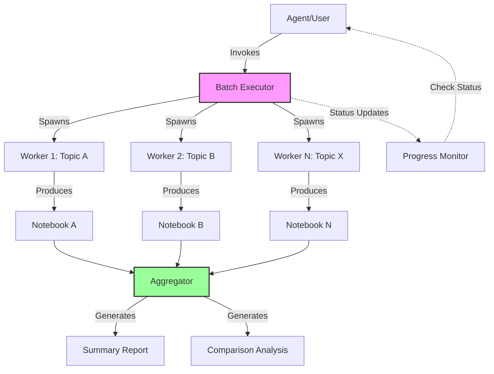

# Sequential Feynman Batch Executor

## Executive Summary

The Sequential Feynman Batch Executor is a programmatic automation tool that enables Claude agents to run the `/sequential-feynman` workflow multiple times in the background, producing validated research notebooks and comprehensive reports without blocking the agent's ability to work on other tasks.

**Key Value**: Transforms a 2-4 hour interactive research workflow into an automated background process that can run X iterations concurrently, allowing agents to delegate deep research while continuing other work.

**Critical Success Factors**:
- Non-blocking execution (agent can continue other tasks)
- Artifact collection (notebooks, reports, analysis)
- Error handling and retry logic
- Progress monitoring and status reporting
- Aggregated summary generation

## Problem Statement

### Current State

The `/sequential-feynman` command is a powerful deep-learning workflow that:
1. Researches a topic comprehensively
2. Creates Feynman-style explanatory notebooks
3. Performs 3 cycles of sequential thinking validation
4. Produces expert-level skill documentation

However, it has limitations:
- **Synchronous execution**: Agent must wait 2-4 hours per topic
- **Single-topic focus**: Cannot research multiple topics in parallel
- **Manual invocation**: Requires interactive command execution
- **No batch processing**: Cannot run multiple iterations for comparison
- **No aggregation**: Results scattered across individual runs

### Pain Points

1. **Agent blocking**: Agent cannot work on other tasks during research
2. **Time inefficiency**: Sequential processing of multiple topics is slow
3. **No comparison**: Cannot easily compare multiple research iterations
4. **Manual collection**: Must manually gather notebooks and reports
5. **Limited automation**: Cannot integrate into larger workflows

### User Impact

**Researchers**: Want to explore multiple perspectives on a topic simultaneously
**Agents**: Need to delegate long-running research without blocking
**Teams**: Require batch processing for systematic knowledge building
**Automation**: Need programmatic access for CI/CD and scheduled research

## Proposed Solution

### High-Level Architecture



### Component Breakdown

#### 1. Batch Executor (Core)
**Responsibility**: Orchestrate multiple sequential-feynman executions
**Interface**: CLI, TypeScript API, Python API
**Key Features**:
- Spawn N parallel or sequential workers
- Track execution status
- Collect artifacts
- Handle errors and retries

#### 2. Worker Process
**Responsibility**: Execute single sequential-feynman workflow
**Interface**: Claude Agent SDK or headless CLI
**Key Features**:
- Run `/sequential-feynman [topic]`
- Capture output (notebooks, skills, logs)
- Report progress
- Handle timeouts

#### 3. Artifact Collector
**Responsibility**: Gather and organize outputs
**Interface**: File system operations
**Key Features**:
- Collect notebooks from `notebooks/feynman-*.ipynb`
- Collect skills from `.claude/skills/*/`
- Organize by iteration and timestamp
- Preserve metadata

#### 4. Report Aggregator
**Responsibility**: Generate summary analysis
**Interface**: Markdown report generator
**Key Features**:
- Compare iterations
- Extract key insights
- Identify patterns
- Generate recommendations

#### 5. Progress Monitor
**Responsibility**: Track and report status
**Interface**: JSON status API
**Key Features**:
- Real-time progress updates
- Error reporting
- Completion notifications
- Resource usage metrics

### Data Flow

```
Input: Topic + Iterations
  ↓
[Batch Executor] spawns workers
  ↓
[Worker 1..N] execute /sequential-feynman
  ↓
[Artifact Collector] gathers outputs
  ↓
[Report Aggregator] analyzes results
  ↓
Output: Notebooks + Skills + Summary Report
```

### Key Design Decisions

#### Decision 1: Execution Mode (Parallel vs Sequential)
- **Context**: Multiple iterations can run concurrently or sequentially
- **Chosen**: Configurable (default: sequential with concurrency limit)
- **Alternatives**: 
  - Always parallel (resource intensive)
  - Always sequential (slow)
- **Rationale**: Flexibility allows users to balance speed vs resources. Default protects against resource exhaustion while allowing power users to maximize throughput.

#### Decision 2: SDK vs Headless CLI
- **Context**: Two ways to invoke Claude Code programmatically
- **Chosen**: Provide both implementations
- **Alternatives**:
  - SDK only (more control, requires Node/Python)
  - CLI only (simpler, less control)
- **Rationale**: Different use cases favor different approaches. SDK for complex orchestration, CLI for simple scripts.

#### Decision 3: Background Execution Strategy
- **Context**: How to run without blocking
- **Chosen**: Detached process with status file
- **Alternatives**:
  - Job queue system (complex)
  - Async/await only (still blocks event loop)
- **Rationale**: Detached processes are simple, portable, and truly non-blocking. Status files enable monitoring without complex IPC.

#### Decision 4: Artifact Organization
- **Context**: Where to store outputs
- **Chosen**: Timestamped directory structure
```
feynman-batch-outputs/
  [run-id]/
    iteration-1/
      notebook.ipynb
      skill/
      metadata.json
    iteration-2/
      ...
    REPORT.md
    STATUS.json
```
- **Alternatives**:
  - Flat structure (hard to navigate)
  - Database (overkill)
- **Rationale**: Hierarchical structure is intuitive, git-friendly, and supports incremental results.

## Implementation Plan

### Phase 1: Core Shell Script (Week 1)
**Goal**: Basic headless mode batch execution

**Tasks**:
1. Create `scripts/feynman-batch.sh`
   - Accept topic and iteration count
   - Loop and invoke `claude -p "/sequential-feynman [topic]"`
   - Collect outputs to timestamped directory
   - Generate basic summary report

2. Add error handling
   - Retry logic (3 attempts)
   - Timeout handling (4 hours per iteration)
   - Graceful failure (continue on error)

3. Create status tracking
   - JSON status file
   - Progress percentage
   - ETA calculation

**Success Metrics**:
- ✅ Can run 3 iterations of sequential-feynman
- ✅ Outputs organized in directory structure
- ✅ Basic report generated
- ✅ Status queryable via JSON file

### Phase 2: TypeScript SDK Implementation (Week 2)
**Goal**: Programmatic API for Node.js/TypeScript

**Tasks**:
1. Create `src/batch-executor.ts`
   - `runFeynmanBatch(topic, iterations, options)` function
   - Use `@anthropic-ai/claude-agent-sdk`
   - Implement parallel execution with concurrency limit
   - Artifact collection and organization

2. Create `src/report-generator.ts`
   - Parse notebooks and extract insights
   - Compare iterations
   - Generate markdown report

3. Create `src/progress-monitor.ts`
   - Real-time progress events
   - Status API
   - Completion callbacks

4. Package and publish
   - `package.json` with dependencies
   - TypeScript types
   - README with examples

**Success Metrics**:
- ✅ TypeScript API functional
- ✅ Can run in parallel with concurrency limit
- ✅ Event-based progress monitoring
- ✅ Published as npm package

### Phase 3: Python SDK Implementation (Week 3)
**Goal**: Python API for data science workflows

**Tasks**:
1. Create `feynman_batch/executor.py`
   - `run_feynman_batch(topic, iterations, options)` function
   - Use `claude-agent-sdk`
   - Implement async execution
   - Artifact collection

2. Create `feynman_batch/analyzer.py`
   - Jupyter notebook parsing
   - Statistical analysis
   - Comparison metrics

3. Create `feynman_batch/monitor.py`
   - Progress tracking
   - Status API
   - Async/await support

4. Package and publish
   - `pyproject.toml`
   - Type hints
   - README with examples

**Success Metrics**:
- ✅ Python API functional
- ✅ Async/await support
- ✅ Jupyter notebook analysis
- ✅ Published to PyPI

### Phase 4: Agent Tool Integration (Week 4)
**Goal**: Make available as agent tool

**Tasks**:
1. Create MCP server wrapper
   - Tool definition for `run_feynman_batch`
   - Status checking tool
   - Result retrieval tool

2. Create agent skill
   - `.claude/skills/feynman-batch-executor/`
   - Usage patterns
   - Best practices

3. Documentation
   - Integration guide
   - Example workflows
   - Troubleshooting

**Success Metrics**:
- ✅ Available as MCP tool
- ✅ Agent can invoke and monitor
- ✅ Documentation complete
- ✅ Example workflows tested

## Trade-offs and Limitations

### Pros
✅ **Non-blocking**: Agent can work on other tasks
✅ **Scalable**: Run multiple topics in parallel
✅ **Automated**: No manual intervention required
✅ **Comprehensive**: Aggregated reports and analysis
✅ **Flexible**: Multiple execution modes (CLI, SDK, MCP)

### Cons
❌ **Resource intensive**: Multiple Claude API calls
❌ **Time consuming**: Still takes 2-4 hours per iteration
❌ **Cost**: API usage scales with iterations
❌ **Complexity**: More moving parts than simple command
❌ **Storage**: Generates large artifacts (notebooks, skills)

### Known Limitations

1. **No real-time collaboration**: Workers don't share insights
2. **Fixed workflow**: Cannot customize sequential-feynman steps
3. **Local execution only**: No distributed worker support
4. **No incremental results**: Must wait for full completion
5. **Limited comparison**: Basic diff, not semantic analysis

### Performance Considerations

- **Memory**: Each worker needs ~500MB
- **CPU**: Minimal (mostly I/O bound)
- **Network**: High (API calls)
- **Storage**: ~50MB per iteration (notebooks + skills)
- **Time**: 2-4 hours per iteration (sequential)

### Security Implications

- **API keys**: Must be securely stored
- **File permissions**: Outputs should be user-readable only
- **Process isolation**: Workers should not interfere
- **Error logging**: Avoid logging sensitive data

### Cost Analysis

**Per Iteration**:
- API calls: ~$2-5 (depending on model)
- Time: 2-4 hours
- Storage: ~50MB

**For 10 Iterations**:
- API calls: ~$20-50
- Time: 20-40 hours (sequential) or 2-4 hours (parallel with 10 workers)
- Storage: ~500MB

## Alternatives Considered

### Alternative 1: Job Queue System (Celery, Bull)
**Pros**: Robust, distributed, retry logic built-in
**Cons**: Complex setup, requires Redis/RabbitMQ, overkill for use case
**Rejected**: Too much infrastructure for simple batch execution

### Alternative 2: GitHub Actions Workflow
**Pros**: Free compute, parallelization, artifact storage
**Cons**: Requires GitHub, 6-hour timeout, complex secrets management
**Rejected**: Not suitable for local development workflow

### Alternative 3: Jupyter Notebook Extension
**Pros**: Integrated with notebook workflow, visual progress
**Cons**: Requires Jupyter, not CLI-friendly, limited automation
**Rejected**: Too narrow use case, doesn't support CLI/agent usage

## Open Questions / Future Work

### Unresolved Questions
1. Should workers share a knowledge base for cross-pollination?
2. How to handle API rate limits gracefully?
3. Should we support resuming interrupted batches?
4. What's the optimal concurrency limit?

### Future Enhancements
1. **Distributed execution**: Support for remote workers
2. **Incremental results**: Stream partial outputs
3. **Semantic comparison**: Use embeddings to compare insights
4. **Interactive mode**: Allow mid-run adjustments
5. **Cost optimization**: Batch API calls, cache results
6. **Web UI**: Visual progress and result exploration
7. **Integration**: Slack/Discord notifications

### Follow-up Specifications
- Distributed worker architecture spec
- Semantic analysis pipeline spec
- Cost optimization strategies spec

## References

- [Claude Agent SDK Documentation](https://docs.claude.com/en/api/agent-sdk/overview)
- [Claude Code Headless Mode](https://docs.claude.com/en/docs/claude-code/headless)
- [Sequential Feynman Command](.claude/commands/sequential-feynman.md)
- [Enhanced Skill Generator Pipeline](specs/enhanced-skill-generator-pipeline.md)
- [Unix Philosophy](https://en.wikipedia.org/wiki/Unix_philosophy)

## Success Criteria

Implementation is successful when:

- [ ] Shell script can run N iterations and collect artifacts
- [ ] TypeScript SDK provides programmatic API
- [ ] Python SDK provides async API
- [ ] Outputs organized in timestamped directories
- [ ] Summary report generated with comparison
- [ ] Progress monitoring via status file
- [ ] Error handling with retries
- [ ] Documentation complete with examples
- [ ] Agent can use as background tool
- [ ] Cost per iteration documented
- [ ] Performance benchmarks established

## Quick Reference

**Purpose**: Automate batch execution of sequential-feynman workflow
**Input**: Topic + iteration count
**Output**: Notebooks + skills + summary report
**Time**: 2-4 hours per iteration
**Cost**: $2-5 per iteration (API calls)
**Use Cases**: Deep research, comparative analysis, knowledge building
