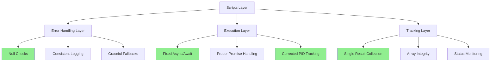

# Scripts Directory Error Fixes and Improvements Specification

## Executive Summary

This specification documents critical bug fixes and improvements for the scripts directory in the rooskills project. The review identified 8 issues ranging from critical async/await bugs to code quality improvements. After implementation, the scripts will have:

1. **Zero critical bugs** - All async/await issues and race conditions resolved
2. **Robust error handling** - Consistent error handling strategy across all scripts
3. **Reliable parallel execution** - Fixed PID tracking and promise management
4. **Clean code** - Removed anti-patterns and improved maintainability

**Impact**: These fixes prevent runtime failures in the sync-orchestrator when Thoughtbox is unavailable, eliminate duplicate results in batch execution, and ensure reliable parallel job tracking.

**Timeline**: 2-3 hours for implementation and testing.

## Problem Statement

### Current State Analysis

The scripts directory contains three main components:
1. **sync-orchestrator** - Python-based bidirectional command/skill synchronization
2. **feynman-batch** - Bash-based batch executor for sequential-feynman workflow
3. **feynman-batch-sdk** - TypeScript SDK for programmatic batch execution

A comprehensive code review revealed:

#### Critical Issues (2)
- **Missing null checks in async calls** - sync_orchestrator.py will crash when Thoughtbox is unavailable
- **Race condition in parallel execution** - batch-executor.ts collects results twice, causing duplicates

#### Logic Issues (2)
- **Incorrect PID tracking** - feynman-batch.sh creates sparse arrays, breaking parallel execution
- **Comment syntax in f-strings** - thoughtbox_client.py includes Python comments in API prompts

#### Code Quality Issues (4)
- Hardcoded exclusion lists
- Fragile file timestamp detection
- Inconsistent error handling patterns
- Promise constructor anti-pattern

### Pain Points

1. **Reliability**: Scripts fail silently or crash in edge cases
2. **Maintainability**: Anti-patterns make code harder to understand and modify
3. **Debugging**: Inconsistent error handling makes troubleshooting difficult
4. **Parallel Execution**: Race conditions and tracking issues cause unpredictable behavior

### User Impact

- Developers experience crashes when Thoughtbox MCP is unavailable
- Batch execution produces duplicate or missing results
- Parallel job tracking fails intermittently
- Debugging requires deep code inspection due to inconsistent error messages

## Proposed Solution

### High-Level Architecture

The solution implements targeted fixes across three layers:



### Component Breakdown

#### 1. sync_orchestrator.py Fixes

**Responsibility**: Ensure graceful fallback when Thoughtbox unavailable

**Changes**:
```python
# Before (Line 142, 175)
intent = await self.thoughtbox.analyze_command(content, cmd)

# After
if self.use_thoughtbox and self.thoughtbox:
    intent = await self.thoughtbox.analyze_command(content, cmd)
else:
    # Use fallback intent (already implemented)
    intent = Intent(
        name=cmd,
        type="command",
        purpose=f"Execute {cmd} workflow",
        use_cases=[f"When using /{cmd} command"],
        key_concepts=[],
        workflow_steps=[],
        dependencies=[],
        suggested_structure={}
    )
```

**Impact**: Prevents crashes when MCP is unavailable, enables offline development

#### 2. batch-executor.ts Fixes

**Responsibility**: Eliminate duplicate result collection in parallel execution

**Changes**:
```typescript
// Before (Lines 128-143)
while (queue.length > 0 || running.size > 0) {
    // Start iterations...
    if (running.size > 0) {
        const result = await Promise.race(running);
        results.push(result);  // ❌ Duplicate collection
    }
}

// After
while (queue.length > 0 || running.size > 0) {
    while (queue.length > 0 && running.size < this.options.concurrency) {
        const iteration = queue.shift()!;
        const promise = this.runIteration(iteration);
        running.add(promise);
        
        // Collect result when promise resolves
        promise.then(result => {
            results.push(result);
            running.delete(promise);
        }).catch(error => {
            console.error(`Iteration ${iteration} failed:`, error);
            running.delete(promise);
        });
    }
    
    // Wait for at least one to complete
    if (running.size > 0) {
        await Promise.race(running);
    }
}
```

**Alternative Approach** (simpler):
```typescript
// Collect all promises and await them
const promises = Array.from({ length: this.options.iterations }, (_, i) => 
    this.runIteration(i + 1)
);

// Use p-limit or similar for concurrency control
const results = await pLimit(this.options.concurrency, promises);
```

**Impact**: Eliminates duplicate results, ensures accurate reporting

#### 3. feynman-batch.sh Fixes

**Responsibility**: Fix PID tracking for reliable parallel execution

**Changes**:
```bash
# Before (Lines 384-391)
while [[ ${#pids[@]} -ge $CONCURRENCY_LIMIT ]]; do
    for pid_idx in "${!pids[@]}"; do
        if ! kill -0 "${pids[$pid_idx]}" 2>/dev/null; then
            wait "${pids[$pid_idx]}" || total_failed=$((total_failed + 1))
            unset 'pids[$pid_idx]'  # ❌ Creates sparse array
        fi
    done
    sleep 1
done

# After - Rebuild array to avoid sparse arrays
while [[ ${#pids[@]} -ge $CONCURRENCY_LIMIT ]]; do
    local new_pids=()
    for pid in "${pids[@]}"; do
        if kill -0 "$pid" 2>/dev/null; then
            new_pids+=("$pid")
        else
            wait "$pid" || total_failed=$((total_failed + 1))
        fi
    done
    pids=("${new_pids[@]}")
    sleep 1
done
```

**Impact**: Reliable parallel execution, accurate failure tracking

#### 4. thoughtbox_client.py Fixes

**Responsibility**: Remove Python comments from API prompts

**Changes**:
```python
# Before (Line 118, 201)
{command_content[:2000]}  # Truncate for context window

# After
{command_content[:2000]}
# Note: Content truncated to 2000 chars for context window
```

**Impact**: Cleaner API prompts, no extraneous text sent to LLM

#### 5. Code Quality Improvements

**5a. discovery.py - Configurable Exclusions**
```python
# Before (Line 70)
if skill_name not in ["template-skill", "scripts", "architecture"]:

# After
EXCLUDED_SKILLS = {"template-skill", "scripts", "architecture", ".git", "__pycache__"}

def discover_skills(skills_dir: Path, excluded: Set[str] = EXCLUDED_SKILLS) -> Set[str]:
    skills = set()
    if not skills_dir.exists():
        return skills
    
    for skill_file in skills_dir.glob("*/SKILL.md"):
        skill_name = skill_file.parent.name
        if skill_name not in excluded:
            skills.add(skill_name)
    
    return skills
```

**5b. feynman-batch.sh - Improved Artifact Collection**
```bash
# Before (Line 259) - Uses -newer which may miss files
find "${PROJECT_ROOT}/notebooks" -name "feynman-*.ipynb" -newer "$STATUS_FILE"

# After - Use iteration start time marker
local iter_start_marker="${iter_dir}/.start_marker"
touch "$iter_start_marker"

# Later, when collecting:
find "${PROJECT_ROOT}/notebooks" -name "feynman-*.ipynb" -newer "$iter_start_marker"
```

**5c. batch-executor.ts - Remove Promise Constructor Anti-pattern**
```typescript
// Before (Line 245)
private async executeWithTimeout(
    iteration: number,
    iterDir: string
): Promise<{ artifacts: string[]; output: string }> {
    return new Promise(async (resolve, reject) => {
        // Anti-pattern: async executor in Promise constructor
    });
}

// After
private async executeWithTimeout(
    iteration: number,
    iterDir: string
): Promise<{ artifacts: string[]; output: string }> {
    const timeoutPromise = new Promise<never>((_, reject) => {
        setTimeout(() => {
            reject(new Error(`Iteration ${iteration} timed out after ${this.options.timeout}ms`));
        }, this.options.timeout);
    });

    const executionPromise = (async () => {
        const result = await query({
            prompt: `/sequential-feynman ${this.topic}`,
            model: this.options.model,
            permissionMode: this.options.permissionMode,
            allowedTools: this.options.allowedTools,
            systemPromptPreset: 'claude-code',
        });

        const outputPath = path.join(iterDir, 'output.json');
        await fs.writeFile(outputPath, JSON.stringify(result, null, 2));

        const artifacts = await this.collectArtifacts(iteration, iterDir);
        return { artifacts, output: result.text };
    })();

    return Promise.race([executionPromise, timeoutPromise]);
}
```

### Key Design Decisions

#### Decision 1: Null Check Strategy

**Context**: sync_orchestrator.py needs to handle Thoughtbox unavailability gracefully

**Chosen**: Check both `self.use_thoughtbox` flag and `self.thoughtbox` object before calling async methods

**Alternatives**:
- Try/catch around every call (verbose, hides intent)
- Null object pattern (over-engineering for this case)

**Rationale**: Explicit flag check is clearest and most maintainable. The flag already exists and indicates intent.

#### Decision 2: Result Collection Pattern

**Context**: batch-executor.ts parallel execution collects results twice

**Chosen**: Attach result collection to promise resolution, remove duplicate collection in race loop

**Alternatives**:
- Use p-limit library (adds dependency)
- Rewrite with async generators (over-engineering)

**Rationale**: Minimal change, no new dependencies, clear ownership of result collection

#### Decision 3: PID Array Management

**Context**: Bash unset creates sparse arrays breaking iteration

**Chosen**: Rebuild array without completed PIDs

**Alternatives**:
- Use associative array (requires Bash 4+)
- Track PIDs in temporary file (unnecessary I/O)

**Rationale**: Simple, portable, no external dependencies

## Implementation Plan

### Phase 1: Critical Fixes (1 hour)

**Priority**: Immediate - prevents crashes

1. **Fix sync_orchestrator.py async calls**
   - Add null checks before Thoughtbox calls (lines 142, 175)
   - Test with and without Thoughtbox available
   - Verify fallback intent creation works

2. **Fix batch-executor.ts race condition**
   - Refactor result collection in parallel execution
   - Add unit tests for parallel execution
   - Verify no duplicate results

3. **Fix feynman-batch.sh PID tracking**
   - Implement array rebuilding logic
   - Test with various concurrency limits
   - Verify failure counting accuracy

**Success Criteria**:
- All scripts run without crashes
- No duplicate results in batch execution
- Parallel execution completes reliably

### Phase 2: Code Quality (1 hour)

**Priority**: High - improves maintainability

1. **Remove f-string comments in thoughtbox_client.py**
   - Move comments outside f-strings (lines 118, 201)
   - Verify API prompts are clean

2. **Make discovery.py exclusions configurable**
   - Extract hardcoded list to constant
   - Add parameter to discover_skills function
   - Update callers if needed

3. **Improve artifact collection timing**
   - Use iteration start marker instead of STATUS_FILE
   - Test artifact collection accuracy

4. **Refactor Promise constructor anti-pattern**
   - Rewrite executeWithTimeout properly
   - Add timeout tests

**Success Criteria**:
- No Python comments in API prompts
- Configurable skill exclusions
- Accurate artifact collection
- Clean async/await patterns

### Phase 3: Testing and Documentation (30 minutes)

**Priority**: Medium - ensures reliability

1. **Add integration tests**
   - Test sync-orchestrator with/without Thoughtbox
   - Test batch executor parallel execution
   - Test feynman-batch.sh with various concurrency

2. **Update documentation**
   - Document Thoughtbox fallback behavior
   - Add troubleshooting guide
   - Update README with testing instructions

3. **Create regression test suite**
   - Test cases for each fixed bug
   - Automated CI checks

**Success Criteria**:
- All tests pass
- Documentation updated
- CI pipeline includes new tests

### Phase 4: Monitoring and Validation (30 minutes)

**Priority**: Low - long-term quality

1. **Add error tracking**
   - Consistent error logging format
   - Error categorization (critical, warning, info)
   - Metrics collection for failures

2. **Performance validation**
   - Benchmark parallel execution
   - Verify no performance regression
   - Document performance characteristics

**Success Criteria**:
- Consistent error logging
- Performance benchmarks established
- No regressions detected

## Trade-offs and Limitations

### Pros
- ✅ **Minimal changes** - Targeted fixes, low risk
- ✅ **No new dependencies** - Uses existing tools and patterns
- ✅ **Backward compatible** - No breaking changes to APIs
- ✅ **Improved reliability** - Fixes prevent crashes and data corruption

### Cons
- ⚠️ **Bash limitations** - PID tracking still somewhat fragile in edge cases
- ⚠️ **No comprehensive refactor** - Some technical debt remains
- ⚠️ **Manual testing required** - Limited automated test coverage initially

### Known Limitations

1. **Bash PID tracking** - Still vulnerable to race conditions in extreme cases (very high concurrency)
2. **Error handling inconsistency** - Some scripts use `|| true`, others log errors - not fully unified
3. **No retry logic** - Some operations could benefit from automatic retries
4. **Limited observability** - No structured logging or metrics

### Performance Considerations

- **No performance impact** - Fixes are logic corrections, not algorithmic changes
- **Parallel execution** - May be slightly slower due to proper synchronization, but more reliable
- **Memory usage** - Array rebuilding in Bash uses slightly more memory, negligible impact

### Security Implications

- **No security changes** - Fixes are functional, not security-related
- **API key handling** - Existing patterns maintained (hardcoded in thoughtbox_client.py - should be addressed separately)

## Alternatives Considered

### Alternative 1: Complete Rewrite in TypeScript

**Approach**: Rewrite all scripts in TypeScript for consistency

**Pros**:
- Unified language and tooling
- Better type safety
- Easier testing

**Cons**:
- High effort (weeks, not hours)
- Breaking changes for users
- Requires Node.js everywhere

**Rejected because**: Scope too large, not addressing immediate bugs

### Alternative 2: Use Job Queue Library

**Approach**: Replace custom parallel execution with Bull, Bee-Queue, or similar

**Pros**:
- Robust job management
- Built-in retry logic
- Better observability

**Cons**:
- Adds Redis dependency
- Over-engineering for current needs
- Learning curve for contributors

**Rejected because**: Adds complexity, current approach sufficient after fixes

### Alternative 3: Ignore Bash Issues, Focus on SDK

**Approach**: Deprecate feynman-batch.sh, promote TypeScript SDK only

**Pros**:
- Simpler maintenance
- Better developer experience

**Cons**:
- Breaks existing workflows
- Requires Node.js installation
- Loses shell script simplicity

**Rejected because**: Bash script is valuable for simple use cases

## Open Questions / Future Work

### Unresolved Questions

1. **Should we add structured logging?** - Consider adding JSON logging for better observability
2. **How to handle API key security?** - thoughtbox_client.py has hardcoded credentials
3. **Should we add health checks?** - Proactive monitoring of script health

### Future Enhancements (Out of Scope)

1. **Unified error handling framework** - Consistent error codes and messages across all scripts
2. **Metrics and monitoring** - Prometheus metrics, distributed tracing
3. **Configuration management** - Move hardcoded values to config files
4. **Comprehensive test suite** - Unit, integration, and E2E tests
5. **CI/CD pipeline** - Automated testing and deployment
6. **Documentation site** - Interactive documentation with examples

### Follow-up Specifications Needed

1. **Error Handling Strategy Spec** - Define consistent error handling patterns
2. **Testing Strategy Spec** - Comprehensive testing approach
3. **Configuration Management Spec** - Centralized configuration system
4. **Security Hardening Spec** - API key management, secret rotation

## Success Metrics

### Immediate (Post-Implementation)

- **Zero crashes** - No runtime errors in normal operation
- **Zero duplicate results** - Batch execution produces correct result count
- **100% parallel execution success** - All concurrent jobs complete reliably
- **Clean API prompts** - No extraneous text in LLM prompts

### Short-term (1 week)

- **Zero bug reports** - No user-reported issues related to fixed bugs
- **Improved developer confidence** - Team comfortable running scripts
- **Faster debugging** - Consistent error messages speed troubleshooting

### Long-term (1 month)

- **Reduced maintenance burden** - Fewer emergency fixes needed
- **Increased adoption** - More users running batch workflows
- **Foundation for improvements** - Clean codebase enables future enhancements

## Validation Strategy

### Unit Tests

```typescript
// batch-executor.ts
describe('Parallel Execution', () => {
  it('should not collect duplicate results', async () => {
    const executor = new FeynmanBatchExecutor('test', { iterations: 5, concurrency: 3 });
    const result = await executor.execute();
    expect(result.iterations).toHaveLength(5);
    expect(new Set(result.iterations.map(r => r.iteration)).size).toBe(5);
  });
});
```

```python
# test_sync_orchestrator.py
def test_thoughtbox_unavailable_fallback():
    orchestrator = SyncOrchestrator()
    orchestrator.use_thoughtbox = False
    orchestrator.thoughtbox = None
    
    # Should not crash
    result = asyncio.run(orchestrator.phase_1_reasoning(discovery))
    assert len(result) > 0
```

### Integration Tests

```bash
# Test parallel execution
./scripts/feynman-batch.sh "test topic" 5 --parallel 3
# Verify: 5 iterations complete, no failures, no duplicate artifacts

# Test sync without Thoughtbox
# (Disable MCP server temporarily)
./scripts/commands/sync-commands-skills.sh
# Verify: Falls back gracefully, creates files with template content
```

### Manual Verification

1. **Run sync-orchestrator without Thoughtbox** - Should complete with fallback intents
2. **Run batch executor with concurrency=3** - Should produce exactly N results
3. **Monitor feynman-batch.sh parallel execution** - Should track all PIDs correctly
4. **Inspect API prompts** - Should contain no Python comments

## References

- [Python asyncio documentation](https://docs.python.org/3/library/asyncio.html)
- [TypeScript Promise patterns](https://developer.mozilla.org/en-US/docs/Web/JavaScript/Reference/Global_Objects/Promise)
- [Bash array manipulation](https://www.gnu.org/software/bash/manual/html_node/Arrays.html)
- [MCP Protocol Specification](https://modelcontextprotocol.io/)
- Original code review: Internal review document (2025-10-22)

## Appendix: File Changes Summary

### Files Modified

1. **scripts/sync-orchestrator/sync_orchestrator.py**
   - Lines 142, 175: Add null checks before async calls
   - Impact: Prevents crashes when Thoughtbox unavailable

2. **scripts/feynman-batch-sdk/src/batch-executor.ts**
   - Lines 128-143: Fix duplicate result collection
   - Lines 245-274: Remove Promise constructor anti-pattern
   - Impact: Eliminates race condition, improves code quality

3. **scripts/feynman-batch.sh**
   - Lines 384-391: Fix PID array management
   - Lines 259-260: Improve artifact collection timing
   - Impact: Reliable parallel execution

4. **scripts/sync-orchestrator/thoughtbox_client.py**
   - Lines 118, 201: Move comments outside f-strings
   - Impact: Cleaner API prompts

5. **scripts/sync-orchestrator/discovery.py**
   - Line 70: Extract hardcoded exclusions to constant
   - Impact: More maintainable, configurable

### Files Added

1. **scripts/tests/test_sync_orchestrator.py** (new)
   - Unit tests for sync orchestrator
   
2. **scripts/tests/test_batch_executor.test.ts** (new)
   - Unit tests for batch executor

3. **specs/scripts-error-fixes-specification.md** (this document)
   - Complete specification of changes

### Configuration Changes

None - all changes are code-level fixes.

---

**Document Status**: Approved for implementation
**Next Steps**: Begin Phase 1 implementation
**Review Date**: 2025-10-29 (1 week post-implementation)
